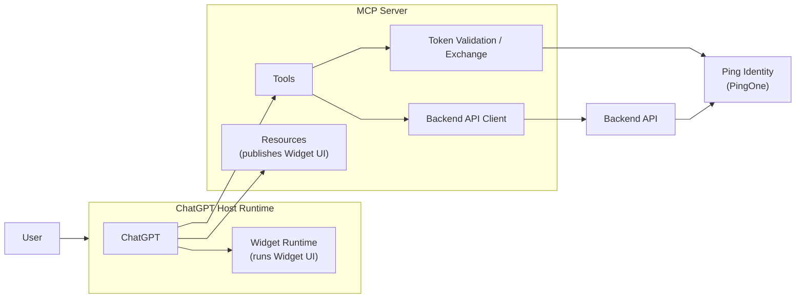
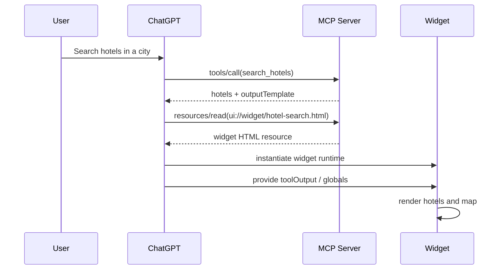
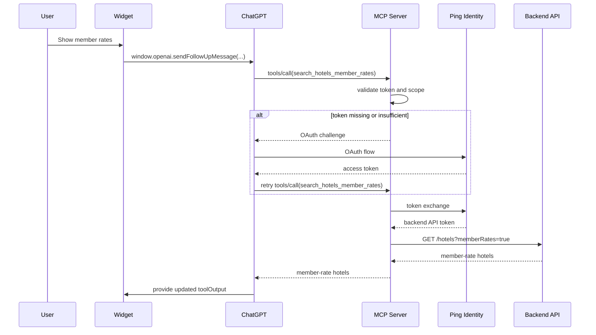
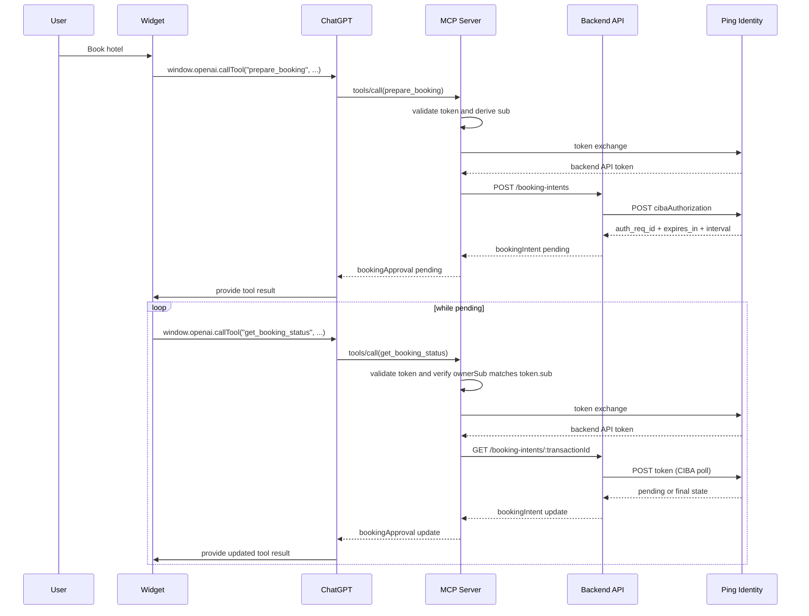

## Context

Many enterprises are now building apps and tools for personal agents, and those agents rarely operate in a single trust model. Some capabilities need access to public or low-friction resources. Others need the agent to act on behalf of a signed-in user to reach private data or protected APIs. Some actions go further and require explicit user approval before the agent can complete them.

In this blog, I describe how the PingOne platform can be used to secure a personal agent through a demo ChatGPT hotel booking app that uses OAuth 2.0, Token Exchange, and CIBA to move from public access to authenticated access and then to transaction approval.

## MyHotels Demo

`MyHotels` is a demo ChatGPT app built with the OpenAI Apps SDK. It lets a user search for hotels, ask for member-only pricing, and start a booking that requires end-user approval before it completes.

The point of the demo is to show how Ping Identity can protect a ChatGPT personal agent when that agent needs to move across different trust levels. In this blog I will focus on the Agent authentication, token exchange and CIBA authorization. In future blogs I will cover MCP protection.

The demo combines:

- ChatGPT
- a demo MCP server
- a widget UI rendered inside ChatGPT
- a demo backend API
- Ping Identity, here through PingOne
- protected actions that need stronger approval than a normal read operation

The source code and the configuration highlights are available here: [ai-myhotels-chatgpt-app](https://github.com/carbonefederico/ai-myhotels-chatgpt-app).

## End User Experience

The following videos demonstrate the end-user experience. First, the no-session journey shows what happens when the user starts from a fresh ChatGPT conversation and crosses from a public flow into a protected one. Second, the existing-session journey shows the same general flow when the user already has an authenticated session and can move more quickly into protected actions:

<video controls preload="metadata" width="100%">
  <source src="{{ '/assets/videos/ChatGPT%20Booking%20-%20New%20Session.mp4' | relative_url }}" type="video/mp4">
  Your browser does not support the video tag.
</video>

<video controls preload="metadata" width="100%">
  <source src="{{ '/assets/videos/ChatGPT%20Booking%20-%20Existing%20Session.mp4' | relative_url }}" type="video/mp4">
  Your browser does not support the video tag.
</video>

## How ChatGPT Apps Work

At a high level, ChatGPT is the host runtime, the demo app exposes capabilities through tools and resources. When ChatGPT decides to call a tool (search hotels), it sends the tool request to the MCP server. When a tool response includes an output template (a map with the hotels), ChatGPT reads the matching resource and mounts the widget UI inside its own runtime.

In `MyHotels`, the main moving parts are:

- ChatGPT as the host runtime
- an MCP server that exposes tools and the widget resource
- a widget UI rendered inside ChatGPT
- a backend REST API that owns hotel and booking state
- Ping Identity, through PingOne, as the identity provider for authentication, token exchange, and CIBA

The high-level interaction looks like this:



The tool surface is small and intentional:

- `search_hotels`
- `search_hotels_member_rates`
- `prepare_booking`
- `get_booking_status`

The widget is delivered as the MCP resource `ui://widget/hotel-search.html`.The widget is not just a public web page that ChatGPT opens. It is a resource served through MCP and mounted by ChatGPT when a tool response references it through `openai/outputTemplate`.

Once mounted, the widget uses the `window.openai` bridge to interact with ChatGPT. In this project that bridge is used in two different ways:

- `sendFollowUpMessage(...)` to ask ChatGPT to call the protected member-rates tool
- `callTool(...)` to invoke booking-related tools directly from the widget

That gives the app a useful split:

- ChatGPT remains the orchestrator
- the widget becomes the interactive UI surface
- the backend systems stay behind the MCP boundary

## The Identity Provider

At a high level, Ping Identity (in this demo via PingOne) plays three different roles. First, it supports user authentication for ChatGPT when the app crosses into protected functionality. Second, it separates the token that ChatGPT uses to call the MCP layer from the token that the backend API expects. The MCP server validates the incoming bearer token and then uses OAuth token exchange to request a new token for the backend API audience and scope. Third, it supports the CIBA approval flow used by the backend for booking approval.

## Token Exchange

The ChatGPT-facing token is meant for the MCP surface. The backend API is a different protected resource with its own audience and scope. Instead of forwarding the original token and overloading its meaning, the MCP server exchanges it for a backend API token.

This gives you clearer boundaries:

- ChatGPT gets a token for the MCP resource
- the MCP server gets a token for the backend API resource
- the backend validates a token that was actually minted for it

In this demo, the exchanged backend token can look like this:

```json
{
  "iss": "https://auth.pingone.../as",
  "aud": "myhotels-hotelapi",
  "sub": "user-123",
  "scope": "my-hotels:api:member-access",
  "client_id": "mcp-token-exchange-client-id",
  "act": {
    "sub": "mcp-token-exchange-client-id",
    "act": {
      "sub": "chatgpt-client-id"
    }
  }
}
```

There are two important things in that token.

First, the token is clearly for the backend API because the audience is `myhotels-hotelapi` and the scope is `my-hotels:api:member-access`.

Second, the token preserves an actor chain. The subject is still the user, `user-123`, but the token also shows that the MCP token-exchange client acted on behalf of the original ChatGPT client. That is exactly the kind of traceability you want when a personal agent triggers downstream API calls through an intermediary service.

## CIBA

In many architectures, the client is the component that initiates CIBA. In this demo, we moved it to the backend for two reasons. First, we wanted approval to be bound to a concrete business transaction. The backend creates the booking intent, owns its lifecycle, and is therefore the natural place to tie approval to that transaction. Second, we do not own the client runtime in the same way we would in a conventional first-party application and we could not initiate CIBA there.

The backend starts CIBA, stores the `auth_req_id`, and maps it to a server-owned transaction ID. The widget only knows the transaction ID and polls for status updates. 

## The User Journeys in Detail

### 1. Public hotel search

The simplest journey starts with a natural-language request such as "show me hotels in Milan".

ChatGPT calls `search_hotels` on the MCP server. The MCP server forwards the request to the backend API and gets public hotel results back. The tool response includes both the hotel data and the widget template reference. ChatGPT then reads `ui://widget/hotel-search.html`, mounts the widget, and passes the tool output into the widget runtime.

The widget then renders:

- a map
- hotel markers
- hotel cards
- standard nightly rates

No authentication is required for this part of the experience.



### 2. Member-rate search

The second journey starts from the rendered widget. The user clicks `Show Member Rates`.

The widget does not fetch pricing directly from the backend. Instead it asks ChatGPT to call `search_hotels_member_rates`. That tool is protected. If the user is not signed in or does not have the required scope, the MCP server returns an OAuth challenge. ChatGPT handles the sign-in flow and retries the tool call with a valid bearer token.

After that:

- the MCP server validates the incoming token locally
- it checks that the required MCP-facing scope is present
- it performs token exchange to obtain a backend API token
- it calls the backend API with the exchanged token
- it returns hotel results with member pricing

The widget updates in place and shows:

- discounted member rates
- savings compared to the standard rate
- the authenticated user display name in the UI

This is a good example of progressive authentication. The user can explore first and authenticate only when the value of signing in is obvious.



### 3. Booking with approval

The booking journey starts when the user clicks `Book` on a hotel card and submits check-in date and number of nights.

The widget calls `prepare_booking`. That tool is also protected, so the MCP server again validates the incoming token and uses token exchange before it calls the backend API.

The backend then creates a booking intent instead of directly confirming a booking. That is an important design decision. The backend owns the transaction and starts a CIBA authorization request using the signed-in user's `sub` as the login hint. It stores:

- the transaction ID
- the booking owner
- the CIBA `auth_req_id`
- the quote and approval state

The widget receives a pending booking status and starts polling `get_booking_status`.

From there the flow is:

1. The backend polls PingOne using the stored `auth_req_id`.
2. PingOne returns `authorization_pending`, `slow_down`, `approved`, `denied`, or expiry.
3. The backend updates the booking intent state.
4. The widget reflects the current state in ChatGPT.

So the user interaction is conversational at the start, visual in the middle, and approval-driven at the end.




## Conclusion

`MyHotels` is a compact but realistic example of how Ping Identity can secure a ChatGPT personal agent across different trust boundaries.

In this demo, PingOne provides the main identity and authorization capabilities that make the flow work safely:

- user authentication when the agent crosses into protected functionality
- audience- and scope-specific token issuance for the MCP layer
- OAuth 2.0 Token Exchange so the backend API receives a token minted for its own protected resource
- actor-chain visibility that preserves how the request moved from ChatGPT to MCP to the backend
- CIBA-based approval for higher-risk actions such as booking

Taken together, those capabilities let the personal agent move from public access to authenticated access and then to explicit transaction approval without collapsing everything into one token or one client-side flow.

That is what makes the demo useful as an architecture reference for enterprises building personal-agent experiences on top of ChatGPT.

A useful follow-up blog would go deeper into MCP authorization itself, especially how to protect MCP tools and resources, how to express authorization boundaries at the MCP layer, and how Ping Identity can help enforce those decisions consistently.

## Links

- Demo app: [ai-myhotels-chatgpt-app](https://github.com/carbonefederico/ai-myhotels-chatgpt-app)
- OAuth 2.0 Token Exchange spec: [RFC 8693](https://datatracker.ietf.org/doc/html/rfc8693)
- CIBA spec: [OpenID Client-Initiated Backchannel Authentication (CIBA) Core](https://openid.net/specs/openid-client-initiated-backchannel-authentication-core-1_0.html)
