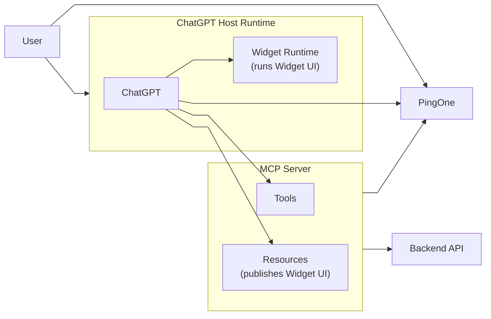
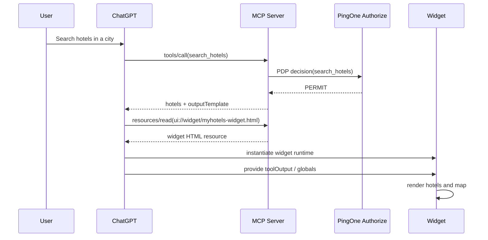
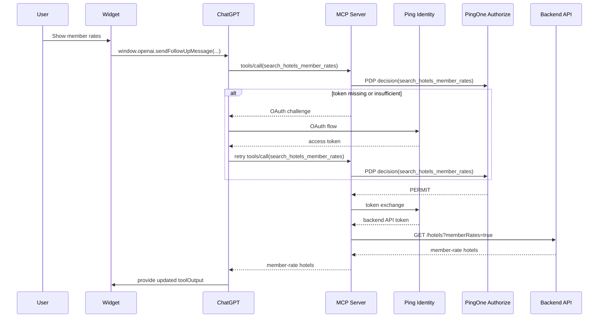
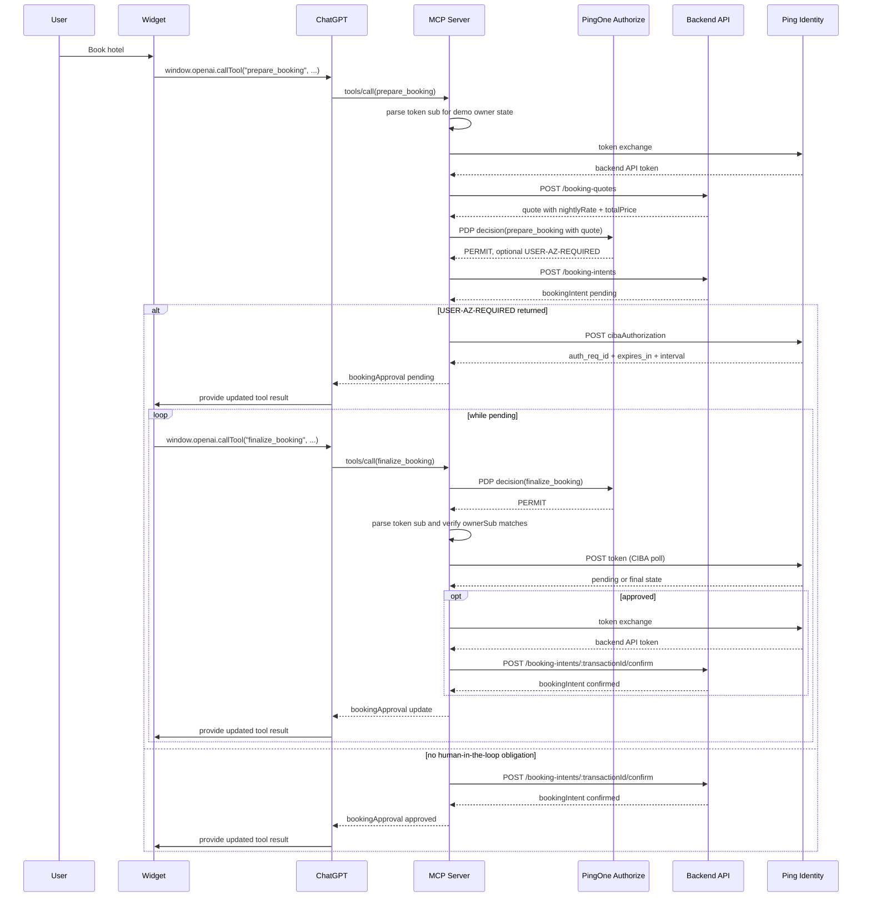

## Context

Enterprises are now building apps and tools for personal agents, and those agents rarely operate in a single trust model. Some capabilities need access to public or low-friction resources. Others need the agent to act on behalf of a signed-in user to reach private data or protected APIs. Some actions go further and require explicit user approval before the agent can complete them.

In this blog, I describe how the PingOne platform can be used to secure a personal agent through a demo ChatGPT hotel booking app that uses OAuth 2.0, PingOne Authorize, Token Exchange, and CIBA to move from public access to authenticated access and then to transaction approval.

## MyHotels Demo

`MyHotels` is a demo ChatGPT app built with the [OpenAI Apps SDK](https://developers.openai.com/apps-sdk). It lets a user search for hotels, ask for member-only pricing, and start a booking that requires end-user approval before it completes. I use this demo application to show how Ping Identity can protect a ChatGPT personal agent when that agent needs to move across different trust levels. 

The following diagram shows the high level logical architecture for the demo.



- User: interacts with ChatGPT and the mounted widget to search hotels, request member rates, and approve or finalize booking actions. The user also signs in and completes approval prompts through PingOne.
- ChatGPT Host Runtime: discovers MCP tools, resources, and authentication requirements; calls MCP tools on behalf of the user; reads widget resources; mounts the widget in its sandboxed runtime; and uses PingOne during the OAuth flow for protected MCP tools.
- Widget Runtime: runs the MyHotels widget UI inside ChatGPT and calls tools back through ChatGPT.
- MCP Server: exposes the hotel tools, publishes the widget HTML as an MCP resource, calls PingOne Authorize for policy decisions, exchanges tokens for backend API access, starts CIBA approval when policy requires end-user consent, and calls the backend hotel API.
- Backend API: owns the demo hotel business surface, including the hotel catalog, member-rate access, booking quotes, booking intents, and mocked booking confirmation.
- PingOne: provides the identity and authorization services used by the demo, including agent registration, user authentication, token exchange, policy decisions, and CIBA-based end-user approval.


## End User Experience

The following videos demonstrate the end-user experience. First, the no-session journey shows what happens when the user starts from a fresh ChatGPT conversation and crosses from a public flow into a protected one. Second, the existing-session journey shows the same general flow when the user already has an authenticated session and can move more quickly into protected actions:

<video controls preload="metadata" width="100%">
  <source src="{{ '/assets/videos/ChatGPT%20Booking%20-%20New%20Session.mp4' | relative_url }}" type="video/mp4">
  Your browser does not support the video tag.
</video>


<video controls preload="metadata" width="100%">
  <source src="{{ '/assets/videos/ChatGPT%20Booking%20-%20Existing%20Session.mp4' | relative_url }}" type="video/mp4">
  Your browser does not support the video tag.
</video>

The following video shows the booking flow when the policy uses transaction thresholds: bookings below `200 EUR` proceed without additional approval, bookings above `200 EUR` require user approval, and bookings above `1000 EUR` are denied.

<video controls preload="metadata" width="100%">
  <source src="{{ '/assets/videos/ChatGPT%20Booking%20-%20End%20user%20-%20Existing%20Session%20below%20%26%20above%20threshold.mp4' | relative_url }}" type="video/mp4">
  Your browser does not support the video tag.
</video>

## How ChatGPT Apps Work

At a high level, ChatGPT is the host runtime, and the demo app exposes capabilities through MCP tools and resources. When ChatGPT decides to call a tool such as hotel search, it sends the tool request to the MCP server. When a tool response includes an output template, ChatGPT reads the matching resource and mounts the widget UI inside its own runtime.

The tool surface is small and intentional:

- `search_hotels`
- `search_hotels_member_rates`
- `prepare_booking`
- `finalize_booking`

The widget is delivered as the MCP resource `ui://widget/myhotels-widget.html`. The widget is not just a public web page that ChatGPT opens. It is a resource served through MCP and mounted by ChatGPT when a tool response references it through `openai/outputTemplate`.

Once mounted, the widget uses the `window.openai` bridge to interact with ChatGPT. In this project that bridge is used in two different ways:

- `sendFollowUpMessage(...)` to ask ChatGPT to call the protected member-rates tool
- `callTool(...)` to invoke booking-related tools directly from the widget

That gives the app a useful split:

- ChatGPT remains the orchestrator
- the widget becomes the interactive UI surface
- the backend systems stay behind the MCP boundary

## The Identity Provider

At a high level, Ping Identity plays four different roles in this demo. First, PingOne supports user authentication for ChatGPT when the app crosses into protected functionality. Second, the MCP server uses PingOne Authorize to evaluate each tool call against policy. Third, the MCP server uses OAuth token exchange to obtain a backend API token with the correct audience and scope. Fourth, PingOne supports the CIBA approval flow used by the MCP server for booking approval:

- PingOne handles user sign-in
- PingOne Authorize decides whether the tool call should be allowed
- token exchange gives the backend API a token minted for its own resource
- CIBA handles higher-friction approval when policy requires it

## PingOne Authorize

The current demo does not rely only on OAuth scopes at the MCP layer. Every tool call is sent to PingOne Authorize with a flattened decision payload that identifies the MCP service, the requested tool, selected request parameters, and the inbound ChatGPT bearer token, so that PingOne Authorize can decide whether the tool call should be allowed.

That lets the MCP server enforce a mixed model:

- `search_hotels` is public but still policy-controlled
- `search_hotels_member_rates` requires a signed-in ChatGPT user and the member-rates scope
- `prepare_booking` requires the booking scope and is also evaluated against the booking amount
- `finalize_booking` requires the booking scope and the right booking owner

For booking, the important point is that policy is not binary. The quote amount changes the outcome:

- below `200 EUR`: permit
- above `200 EUR`: permit with a human-in-the-loop obligation
- above `1000 EUR`: deny

So in the current design, PingOne Authorize decides whether booking is allowed immediately, requires explicit user approval, or should be blocked entirely.

## Token Exchange

The ChatGPT-facing token is meant for the MCP surface. The backend API is a different protected resource with its own audience and scopes. Instead of forwarding the original token and overloading its meaning, the MCP server exchanges it for a backend API token.

This gives us clearer boundaries:

- ChatGPT gets a token for the MCP resource
- the MCP server gets a token for the backend API resource
- the backend validates a token that was actually minted for it

In the current configuration, the ChatGPT-facing MCP token can look like this:

```json
{
  "aud": "myhotels-hotelmcp",
  "sub": "user-123",
  "given_name": "Alice",
  "groups": ["ChatGPT User"],
  "act": {
    "sub": "chatgpt-client-id"
  }
}
```

In this demo, the exchanged backend token can look like this:

```json
{
  "iss": "https://auth.pingone.../as",
  "aud": "myhotels-hotelapi",
  "sub": "user-123",
  "scope": "my-hotels:api:member_rates",
  "client_id": "mcp-token-exchange-client-id",
  "act": {
    "sub": "mcp-token-exchange-client-id",
    "act": {
      "sub": "chatgpt-client-id"
    }
  }
}
```

There are two important things in these tokens.

First, the token audiences and scopes stay separated. The ChatGPT-facing token is for the MCP resource. The exchanged token is for the backend API and carries one of the backend API scopes such as `my-hotels:api:member_rates` or `my-hotels:api:book`.

Second, the token preserves an actor chain. The first token already identifies the ChatGPT client as the acting party. After exchange, the subject is still the user, `user-123`, but the token now also shows that the MCP token-exchange client acted on behalf of the original ChatGPT client. That is exactly the kind of traceability we want when a personal agent triggers downstream API calls through an intermediary service.

## CIBA

In many architectures, the client is the component that initiates CIBA. In this demo, we moved it to the MCP server rather than the ChatGPT client. We still wanted approval to be bound to a concrete business transaction, but we do not control the ChatGPT runtime like a conventional first-party client. The MCP layer is therefore the practical control point: it has the user context, it receives the policy obligation from PingOne Authorize, it can initiate approval with PingOne, and it can coordinate the protected call path to the backend API.

The backend still owns the booking intent and its lifecycle. The MCP server starts CIBA, stores the `auth_req_id`, and maps it to the server-side transaction ID returned by the backend. The widget only knows the transaction ID and polls for status updates.

## The User Journeys in Detail

### 1. Public hotel search

The simplest journey starts with a natural-language request such as "show me hotels in Milan".

ChatGPT calls `search_hotels` on the MCP server. The MCP server first asks PingOne Authorize for a policy decision. If the decision is `PERMIT`, it returns hotel results and the widget template reference. ChatGPT then reads `ui://widget/myhotels-widget.html`, mounts the widget, and passes the tool output into the widget runtime.

The widget then renders:

- a map
- hotel markers
- hotel cards
- standard nightly rates

No authentication is required for this part of the experience.



### 2. Member-rate search

The second journey starts from the rendered widget. The user clicks `Show Member Rates`.

The widget does not fetch pricing directly from the backend. Instead it asks ChatGPT to call `search_hotels_member_rates`. That tool is protected. If the user is not signed in or does not have the required scope, the MCP server returns an OAuth challenge. ChatGPT handles the sign-in flow and retries the tool call with a valid bearer token.

After that:

- the MCP server asks PingOne Authorize for a decision using the inbound bearer token
- PingOne Authorize verifies that the caller is a ChatGPT user and that the MCP token has the required scope
- it performs token exchange to obtain a backend API token
- it calls the backend API with the exchanged token
- it returns hotel results with member pricing

The widget updates in place and shows:

- discounted member rates
- savings compared to the standard rate
- the authenticated user display name in the UI

This is a good example of progressive authentication. The user can explore first and authenticate only when the value of signing in is obvious.



### 3. Booking with approval

The booking journey starts when the user clicks `Book` on a hotel card and submits check-in date and number of nights.

The widget calls `prepare_booking`. That tool is also protected, but the logic is now more nuanced than a simple authenticated-or-not check.

The MCP first exchanges the token for a backend API token and asks the backend for an authoritative booking quote. It then sends the inbound bearer token, the tool name, and the quote attributes such as `totalPrice` and `currency` to PingOne Authorize. If policy returns `PERMIT`, MCP creates the booking intent. If policy also returns a human-in-the-loop obligation, MCP starts CIBA. If no such obligation is returned, MCP can confirm the booking immediately.

This is a useful design choice because the approval threshold is policy-driven rather than hard-coded into the app.

Across the MCP and backend layers, the system stores:

- the transaction ID
- the booking owner
- the CIBA `auth_req_id`
- the quote and approval state

The widget receives either an immediate confirmation or a pending booking status. For approval-driven bookings, it starts polling `finalize_booking`.

From there the flow is:

1. The MCP server asks PingOne Authorize for each finalization attempt.
2. It verifies that the caller still matches the booking owner.
3. It polls PingOne using the stored `auth_req_id`.
4. When approval reaches `approved`, the MCP server exchanges the token again if needed and confirms the backend booking intent.
5. The widget reflects the current state in ChatGPT.

So the user interaction is conversational at the start, visual in the middle, and approval-driven at the end.




## Conclusion

`MyHotels` is a compact but realistic example of how Ping Identity can secure a ChatGPT personal agent across different trust boundaries. In this demo, PingOne provides the main identity capabilities that make the flow work safely:

- user authentication when the agent crosses into protected functionality
- centralized MCP authorization through PingOne Authorize
- audience and scope-specific token issuance for the MCP layer
- OAuth 2.0 Token Exchange so the backend API receives a token minted for its own protected resource
- actor-chain visibility that preserves how the request moved from ChatGPT to MCP to the backend
- CIBA-based approval for higher-risk actions such as booking
- policy-based thresholds that can allow, step up, or deny booking actions based on amount

Taken together, those capabilities let the personal agent move from public access to authenticated access and then to explicit transaction approval without collapsing everything into one token or one client-side flow.

## Links

- Demo app: [ai-myhotels-chatgpt-app](https://github.com/carbonefederico/ai-myhotels-chatgpt-app)
- OAuth 2.0 Token Exchange spec: [RFC 8693](https://datatracker.ietf.org/doc/html/rfc8693)
- CIBA spec: [OpenID Client-Initiated Backchannel Authentication (CIBA) Core](https://openid.net/specs/openid-client-initiated-backchannel-authentication-core-1_0.html)
- OpenAI Apps SDK: [OpenAI Apps SDK](https://developers.openai.com/apps-sdk)
