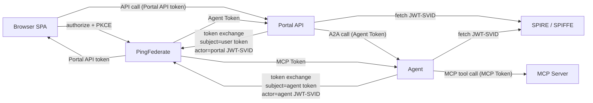
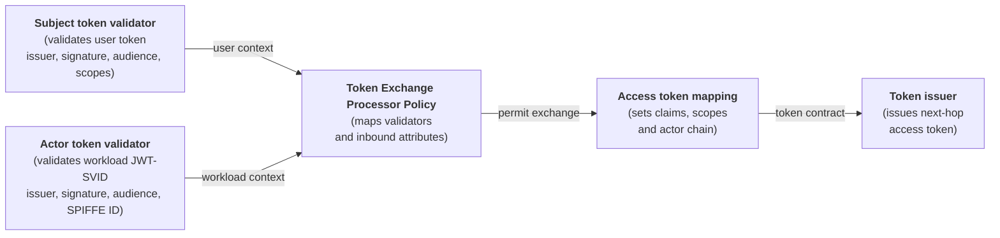

## Context

Agentic systems change the identity problem. The user may start the request, but the agent decides how to complete it. It may call tools, invoke other services, inspect intermediate results, and change the plan as the session progresses. That means the important question is no longer only “who is the user?” It is also “which agent or workload acted, on behalf of whom, and why was that action allowed?”

Traditional identity models usually give us two categories: human users and workloads. Workloads often authenticate with service accounts, API keys, or client credentials. That works for simple automation, but it becomes weak for agentic flows which are delegated, dynamic and non-deterministic. Furthermore, if every downstream call only shows a generic service identity, the audit trail loses the real story. A protected API may see “the agent service called me,” but not that a specific agent acted for a specific user after a specific tool decision.

That is unsafe because accountability becomes partial. Security teams need to answer who did what, when, and why. Downstream systems need enough context to enforce fine-grained policies. Incident responders should not have to reconstruct a session by stitching together disconnected logs from the browser, portal, agent, and tools. The identity context should travel with the flow. The architecture needs a way to propagate both user identity and actor identity across hops, without collapsing everything into one broad user token or one generic service account.

This blog uses a dummy telco customer-support chatbot to show how Ping Identity can support a safer model. The business behavior is intentionally simple. The important part is the identity chain across the browser, the web application, the agent, the MCP server, PingFederate, and SPIRE.

The pattern is:

- use OAuth 2.0 Token Exchange to mint a new access token at each service boundary
- use SPIFFE/SPIRE to give each workload an attested identity
- use the workload JWT-SVID as the token exchange actor token
- let each receiving service validate a token minted for its own audience

That gives us user delegation and workload identity in the same flow.

## Why Token Exchange

[RFC 8693](https://datatracker.ietf.org/doc/html/rfc8693) defines OAuth 2.0 Token Exchange. It describes a protocol for requesting and obtaining security tokens from OAuth authorization servers, including tokens that support delegation.

The important part for this demo is the request model. A client sends a `subject_token`, an `actor_token`, and asks for a token with a target audience and scope. The `subject_token` represents the party on behalf of whom the token is requested, while the `actor_token` represents the party receiving delegated rights. That maps naturally to agentic systems.

The user remains the subject. The portal and agent are actors. Each actor gets only the token it needs for the next hop. The receiving service can validate the audience, scopes, subject, and actor chain instead of guessing intent from a token minted for another resource.

This matters for three reasons:
- auditability. If an agent reads payment data, we want logs and tokens to show the user and the workload path, not just a generic service account.
- policy. PingFederate can allow the portal workload to request only an agent-audience token, and allow the agent workload to request only an MCP-audience token. The customer scopes can travel across the chain, but each token is still minted for the next workload. That is more precise than giving a backend service account broad standing access.
- containment. Reusing a user token across services spreads a bearer credential beyond its intended audience. Using a generic service account loses the user delegation context. Token exchange avoids both problems by minting a new, constrained token for the next resource.

## Why SPIFFE And SPIRE

[SPIFFE](https://spiffe.io/docs/latest/spiffe-about/overview/) gives software components a standard way to identify themselves. A component can be an API, an agent, a worker, or any service running in the platform. Instead of saying "this is some pod" or "this is some service account," SPIFFE gives it a stable identity string called a SPIFFE ID, for example `spiffe://ping.demo/ns/spiffe-token-exchange-demo/sa/portal`.

[SPIRE](https://spiffe.io/docs/latest/spire-about/spire-concepts/) is one implementation of SPIFFE. Its job is to check what a workload really is and then issue a short-lived credential for it. That check is what "attestation" means. In Kubernetes, SPIRE can look at platform facts such as the namespace, pod labels, and service account. If those facts match the configured rules, SPIRE gives the workload a credential.

That credential is called an SVID, or SPIFFE Verifiable Identity Document. In simpler terms, it is a signed identity document for the workload. When the portal gets a JWT-SVID, it is getting a signed token that says "this workload is the portal service" and includes the portal SPIFFE ID. When the agent gets one, it says "this workload is the agent service."

In this project the portal and agent request JWT-SVIDs from the SPIFFE API. Those JWT-SVIDs are short-lived workload credentials. The services send them to PingFederate as `actor_token` values during token exchange.

That gives PingFederate two independent facts:

- the `subject_token` is the incoming OAuth access token representing the user
- the `actor_token` is the SPIFFE JWT-SVID proving which workload is asking for the next token

No shared secret is needed between the workload and PingFederate. The trust is based on PingFederate validating the JWT-SVID issuer, signature, audience, and SPIFFE subject.

## Demo Architecture

The browser uses Authorization Code + PKCE with PingFederate. After that, the server-side path uses token exchange with SPIFFE JWT-SVID actor tokens.



The main components are:

- Browser SPA: signs the user in with PingFederate and calls the portal API.
- Portal API: validates the browser token, exchanges it for an agent token, and forwards the user request to the agent.
- Agent: validates the agent token, chooses MCP tools, exchanges the token again for the MCP audience, and calls the MCP server.
- MCP server: validates the MCP token and enforces tool scopes before returning customer data.
- PingFederate: issues browser, agent, and MCP access tokens, and validates the SPIFFE JWT-SVID actor token during token exchange.
- SPIRE: issues JWT-SVIDs to Kubernetes workloads through the SPIFFE Workload API.

## Expected Flow

A normal support request follows this path:

1. The user signs in through the Browser SPA.
2. PingFederate issues a Portal API token to the Browser SPA.
3. The Browser SPA calls `POST /api/chat` on the Portal API with the Portal API token.
4. The Portal API validates the Portal API token.
5. The Portal API fetches a portal JWT-SVID from SPIRE / SPIFFE.
6. The Portal API sends a token exchange request to PingFederate with the Portal API token as the subject token and the portal JWT-SVID as the actor token.
7. PingFederate issues an Agent Token to the Portal API.
8. The Portal API calls `POST /a2a/message` on the Agent with the Agent Token.
9. The Agent validates the Agent Token and chooses MCP tools.
10. The Agent fetches an agent JWT-SVID from SPIRE / SPIFFE.
11. The Agent sends a token exchange request to PingFederate with the Agent Token as the subject token and the agent JWT-SVID as the actor token.
12. PingFederate issues an MCP Token to the Agent.
13. The Agent calls the MCP Server with the MCP Token.
14. The MCP Server validates audience and scopes before returning profile or payment data.


The video below shows the demo from the application point of view. It starts with a signed-in user invoking the chatbot, then opens the token flow view where the tokens are surfaced for demo purposes:
- at each hop, the subject remains the user who initiated the action
- each exchange uses the current access token as the subject token and the workload JWT-SVID as the actor token
- scopes are reduced as the request moves from the Portal API to the Agent and then to the MCP Server

<video controls preload="metadata" width="100%">
  <source src="{{ '/assets/videos/SPIFFE%20Token%20Exchange.mp4' | relative_url }}" type="video/mp4">
  Your browser does not support the video tag.
</video>

## Workload Identity Model

The Kubernetes manifest defines service accounts for the three workloads and `ClusterSPIFFEID` resources that map pods to SPIFFE IDs:

```text
spiffe://ping.demo/ns/spiffe-token-exchange-demo/sa/portal
spiffe://ping.demo/ns/spiffe-token-exchange-demo/sa/agent
spiffe://ping.demo/ns/spiffe-token-exchange-demo/sa/mcp
```

The portal and agent mount the SPIFFE Workload API socket:

```yaml
volumeMounts:
  - name: spiffe-workload-api
    mountPath: /spiffe-workload-api
    readOnly: true
volumes:
  - name: spiffe-workload-api
    csi:
      driver: csi.spiffe.io
      readOnly: true
```

Once the socket is mounted, the application can call the SPIFFE Workload API from inside the pod and ask for a JWT-SVID. The requested JWT-SVID audience is the value PingFederate expects for token exchange validation.

The client IDs intentionally match the SPIFFE IDs:

```text
API_OAUTH_CLIENT_ID=spiffe://ping.demo/ns/spiffe-token-exchange-demo/sa/portal
AGENT_OAUTH_CLIENT_ID=spiffe://ping.demo/ns/spiffe-token-exchange-demo/sa/agent
SPIFFE_JWT_SVID_AUDIENCE=pingfederate-token-exchange
```

That gives PingFederate a direct mapping between the OAuth token-exchange client and the attested workload identity.

## Fetching The JWT-SVID

The software fetches a JWT-SVID before calling the PingFederate token endpoint. The important request fields are the SPIFFE ID and the audience. In the demo this is done with the SPIFFE/SPIRE Python SDK through `WorkloadApiClient`:

```python
from spiffe import WorkloadApiClient
from spiffe.spiffe_id.spiffe_id import SpiffeId

socket_path = "unix:/spiffe-workload-api/spire-agent.sock"
audience = "pingfederate-token-exchange"
portal_spiffe_id = "spiffe://ping.demo/ns/spiffe-token-exchange-demo/sa/portal"

# Retrieve the JWT-SVID from the SPIFFE Workload API using the SPIFFE/SPIRE SDK.
with WorkloadApiClient(socket_path=socket_path, default_timeout=5.0) as client:
    svid = client.fetch_jwt_svid(
        audience={audience},
        subject=SpiffeId(portal_spiffe_id),
        timeout=5.0,
    )

portal_jwt_svid = svid.token
```

Decoded, the portal JWT-SVID looks conceptually like this:

```json
{
  "iss": "https://oidc-discovery.ping.demo",
  "sub": "spiffe://ping.demo/ns/spiffe-token-exchange-demo/sa/portal",
  "aud": ["pingfederate-token-exchange"],
  "exp": 1782774000
}
```
The agent gets its own JWT-SVID with its own SPIFFE ID:

```json
{
  "iss": "https://oidc-discovery.ping.demo",
  "sub": "spiffe://ping.demo/ns/spiffe-token-exchange-demo/sa/agent",
  "aud": ["pingfederate-token-exchange"],
  "exp": 1782774000
}
```

These are not API access tokens. They are workload identity documents used as proof of the actor during token exchange.

## Building The Token Exchange Request

The two server-side exchanges use the same RFC 8693 request shape:

- portal to agent: the subject token is the browser access token and the actor token is the portal JWT-SVID
- agent to MCP: the subject token is the agent access token and the actor token is the agent JWT-SVID

For example, the portal-to-agent exchange is a form post to the PingFederate token endpoint. The incoming browser access token becomes the `subject_token`, and the portal JWT-SVID becomes the `actor_token`:

```python
from urllib.parse import urlencode

import httpx

token_endpoint = "https://pingfederate.example.com/as/token.oauth2"
portal_client_id = "spiffe://ping.demo/ns/spiffe-token-exchange-demo/sa/portal"
agent_resource = "spiffe://ping.demo/ns/spiffe-token-exchange-demo/sa/agent"
agent_scopes = "customer:profile:read customer:payments:read"

body = urlencode({
    "grant_type": "urn:ietf:params:oauth:grant-type:token-exchange",
    "subject_token": browser_access_token,
    "subject_token_type": "urn:ietf:params:oauth:token-type:access_token",
    "actor_token": portal_jwt_svid,
    "actor_token_type": "urn:ietf:params:oauth:token-type:jwt",
    "scope": agent_scopes,
    "resource": agent_resource,
    "client_id": portal_client_id,
})

headers = {
    "accept": "application/json",
    "content-type": "application/x-www-form-urlencoded",
}

async with httpx.AsyncClient(timeout=20) as client:
    response = await client.post(token_endpoint, content=body, headers=headers)
    response.raise_for_status()

agent_token = response.json()["access_token"]
```


### Exchange One: Portal To Agent

The browser starts with a user token for the portal API:

```json
{
  "iss": "https://pingfederate.example.com",
  "aud": "customer-support-agent-portal-api",
  "sub": "user-123",
  "scope": "openid profile customer-support-agent:portal-api:chat customer-support-agent:customer:profile:read customer-support-agent:customer:payments:read",
  "customer_id": "cust-1001"
}
```

Before the portal calls the agent, it exchanges that browser token for an agent token. The request uses:

```text
subject_token=<browser access token>
actor_token=<portal JWT-SVID>
audience=spiffe://ping.demo/ns/spiffe-token-exchange-demo/sa/agent
scope=customer-support-agent:customer:profile:read customer-support-agent:customer:payments:read
client_id=spiffe://ping.demo/ns/spiffe-token-exchange-demo/sa/portal
```

The issued token is for the agent:

```json
{
  "iss": "https://pingfederate.example.com",
  "aud": "spiffe://ping.demo/ns/spiffe-token-exchange-demo/sa/agent",
  "sub": "user-123",
  "scope": "customer-support-agent:customer:profile:read customer-support-agent:customer:payments:read",
  "client_id": "spiffe://ping.demo/ns/spiffe-token-exchange-demo/sa/portal",
  "act": {
    "sub": "spiffe://ping.demo/ns/spiffe-token-exchange-demo/sa/portal"
  }
}
```

The agent validates this token against its own SPIFFE ID audience and rejects any token not minted for the agent.

### Exchange Two: Agent To MCP

When the agent needs customer data, it exchanges the agent token for an MCP token. The request uses:

```text
subject_token=<agent access token>
actor_token=<agent JWT-SVID>
audience=spiffe://ping.demo/ns/spiffe-token-exchange-demo/sa/mcp
scope=customer-support-agent:customer:profile:read customer-support-agent:customer:payments:read
client_id=spiffe://ping.demo/ns/spiffe-token-exchange-demo/sa/agent
```

The issued token is for the MCP server:

```json
{
  "iss": "https://pingfederate.example.com",
  "aud": "spiffe://ping.demo/ns/spiffe-token-exchange-demo/sa/mcp",
  "sub": "user-123",
  "scope": "customer-support-agent:customer:profile:read customer-support-agent:customer:payments:read",
  "client_id": "spiffe://ping.demo/ns/spiffe-token-exchange-demo/sa/agent",
  "act": {
    "sub": "spiffe://ping.demo/ns/spiffe-token-exchange-demo/sa/agent",
    "act": {
      "sub": "spiffe://ping.demo/ns/spiffe-token-exchange-demo/sa/portal"
    }
  }
}
```

The MCP server is now seeing a token that was minted for the MCP resource, not a reused portal or agent token. The token also preserves the actor chain: the user is still the subject, the agent is the immediate actor, and the portal remains visible as the previous actor. That chain can be used for audit logs and for fine-grained policy decisions such as "allow payment data only when this user delegated through this agent workload."

The MCP server still enforces authorization at the tool boundary. The profile tool requires `customer-support-agent:customer:profile:read`. The payment tool requires `customer-support-agent:customer:payments:read`. Token exchange gets the request to the right resource with the right scopes; the resource server still validates and enforces them.

## Token Exchange Logic In PingFederate

PingFederate is the authorization server that validates the incoming user token, validates the workload actor token, maps the relevant attributes, evaluates token-exchange policy, and issues the next access token. One important point is that the subject token and actor token can come from different issuers. In this demo, the subject token is a PingFederate access token and the actor token is a SPIRE JWT-SVID. PingFederate can validate each token independently, then combine the resulting user and workload context in the token exchange policy.



At a high level, the demo needs three OAuth clients:

- a browser SPA client for Authorization Code + PKCE
- a portal token-exchange client whose client ID is the portal SPIFFE ID
- an agent token-exchange client whose client ID is the agent SPIFFE ID

The GitHub repository will contain the PingFederate configuration details. The main PingFederate OAuth configuration area is documented in the [PingFederate OAuth configuration guide](https://docs.pingidentity.com/pingfederate/latest/administrators_reference_guide/pf_oauth_config.html).


## When To Use This Pattern

This pattern is useful when a user-facing app calls an intermediate service, and that service calls more protected backend tools or APIs. It is especially useful when those intermediate services are workloads running in Kubernetes and can receive SPIFFE identities automatically.

Use it when you want:

- resource-specific access tokens at every service boundary
- workload identity without distributing static client secrets to pods
- a visible actor chain for delegated calls
- tighter control over which workload can request which downstream audience and scopes

Do not use it as a substitute for API authorization. The final resource server still needs to validate tokens and enforce scopes, claims, and object-level rules. Token exchange gives the resource a better token to validate; it does not remove the need to validate it.

## Key Takeaways

The point of the demo is not that an agent can call a tool. The point is that every call crosses the boundary with the right identity material.

The browser token is for the portal. The portal proves its workload identity with a SPIFFE JWT-SVID and gets an agent token. The agent proves its workload identity with its own JWT-SVID and gets an MCP token. The MCP server receives a token minted for its audience and enforces tool scopes before returning data.

That is the core pattern: user delegation travels through OAuth token exchange, workload identity travels through SPIFFE, and each service validates only the token meant for itself.

One thing this article does not solve is proof of possession. The exchanged tokens are still bearer tokens. A follow-up article should explore binding issued tokens to a key or mTLS channel so possession of the token string alone is not enough to use it.

## Links

- OAuth 2.0 Token Exchange: [RFC 8693](https://datatracker.ietf.org/doc/html/rfc8693)
- SPIFFE overview: [SPIFFE documentation](https://spiffe.io/docs/latest/spiffe-about/overview/)
- SPIRE concepts: [SPIRE documentation](https://spiffe.io/docs/latest/spire-about/spire-concepts/)
- PingFederate OAuth configuration: [PingFederate Server documentation](https://docs.pingidentity.com/pingfederate/latest/administrators_reference_guide/pf_oauth_config.html)
