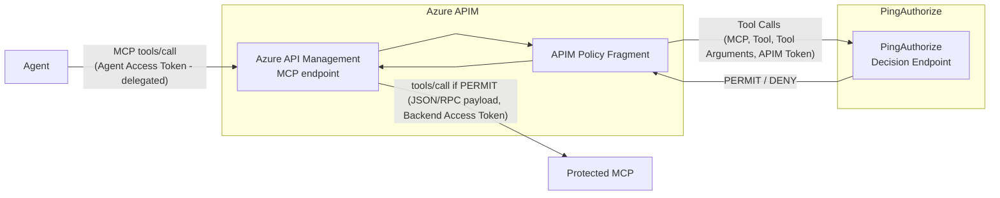

## Context

Large organizations often adopt multiple cloud platforms, modern AI services, and distributed applications, which leads to increasingly fragmented authorization. A single enterprise for example may expose MCPs through Azure, AWS, and on-premises servers.

Each platform introduces its own authorization mechanism, and over time, business rules become scattered across gateways, serverless functions, middleware, and application code. The result is duplicated policies, inconsistent decisions, difficult audits, and expensive maintenance.

PingAuthorize addresses this problem by separating **policy enforcement** from **policy decision making**. Gateways and applications remain responsible for enforcing decisions as Policy Enforcement Points (PEPs), while PingAuthorize acts as the centralized no-code Policy Decision Point (PDP).

This is the first article in a series exploring how PingAuthorize can centralize authorization decisions across different platforms and MCP environments.

I start with **Azure API Management (APIM)** protecting an MCP server, while future articles will apply the same model to other enforcement points such as AWS AgentCore Gateway.

> **Deployment note:** This series uses the PingAuthorize software, deployed in your own environment. PingAuthorize is also available as a cloud-delivered service (PingOne Authorize). The integration component and logic described here — a PEP that sends context to the PDP and enforces the decision — is the same regardless of where the PDP runs.

## What Problem PingAuthorize solves: Sprawl Across Hybrid Environments

As enterprises expand across cloud providers and AI platforms, these challenges emerge.

- **Inconsistent authorization** — Business policies become embedded in platform-specific implementations. The same rule may be implemented differently across gateways, clouds, and applications, producing inconsistent decisions.
- **Policy duplication** — Authorization logic is copied into multiple enforcement points. Every policy change must then be implemented several times, increasing the risk of drift.
- **Authorization logic in code** — Without a dedicated policy engine, teams implement authorization rules directly in application code or middleware. This consumes development cycles and ties every policy change to code reviews, testing, and deployments.
- **Limited governance** — Authorization decisions are distributed across platform-specific logs, making it harder to understand why access was granted or denied and increasing the effort required for auditing and compliance.

PingAuthorize solves those challenges by centralizing **policy evaluation**: it evaluates the business policy and returns the authorization decision. This allows organizations to:

- keep business authorization rules outside applications and MCP servers
- update policies without redeploying APIs
- use contextual and attribute-based authorization
- centralize authorization decisions and audit information
- reuse the same authorization model across different platforms
- gain visibility and improve auditability by logging every authorization decision

## The solution

The first implementation in this series protects a demo Customer MCP Server using Azure API Management. I will present how APIM can be extended via an APIM Policy Fragment that extracts the MCP call details, calls PingAuthorize for a policy decision and returns a decision (PERMIT/DENY) to APIM, which enforces it.

The following diagram depicts the components in the implementation and their interactions.



- **Agent** — invokes MCP tools through APIM using an Agent Access Token (typically obtained via Token Exchange).
- **Azure API Management** — acts as the Policy Enforcement Point. Receives the MCP request, runs the policy fragment, and either forwards the call to the backend MCP or returns a 403.
- **APIM Policy Fragment** — a reusable APIM policy artifact that parses the MCP request, calls the PingAuthorize decision endpoint, and enforces the returned decision. To call the decision endpoint it fetches its own PingAuthorize access token.
- **PingAuthorize** — acts as the Policy Decision Point. Receives the authorization context and returns PERMIT or DENY.
- **Protected MCP** — the protected MCP server (in our context a demo Customer MCP), receives requests only after APIM allows them through.

The important boundary is that APIM does not contain the business authorization logic. It collects context, asks for a decision, and enforces the result.

> **Scope note:** This article focuses on the authorization integration between APIM and PingAuthorize. Token validation, token exchange, and backend MCP server security are outside the scope of this article. In a production setup, APIM would exchange the inbound token for a backend-scoped token before calling the MCP server. For simplicity, the demo MCP server is left open and no token exchanges have been configured in APIM.

## The APIM Policy Fragment

The integration with PingAuthorize is implemented directly as an APIM policy fragment. The fragment performs four operations:

1. Parse the MCP request.
2. Obtain an OAuth token that allows the policy fragment to call PingAuthorize.
3. Call the PingAuthorize Decision Endpoint.
4. Enforce the returned decision.


### 1. Parse the MCP Request

The first part reads the JSON-RPC body and preserves it so APIM can still forward the original request to the MCP server.

```xml
<set-variable
    name="mcp"
    value="@(context.Request.Body.As<JObject>(preserveContent:true))" />

<set-variable
    name="method"
    value="@((string)((JObject)context.Variables["mcp"])["method"])" />

<set-variable
    name="tool"
    value="@((string)((JObject)context.Variables["mcp"])["params"]?["name"])" />

<set-variable
    name="arguments"
    value="@(((JObject)context.Variables["mcp"])["params"]?["arguments"]?.ToString())" />

<set-variable
    name="requestId"
    value="@(((JObject)context.Variables["mcp"])["id"]?.ToString())" />

<set-variable name="incomingBearer" value="@{
    var auth = context.Request.Headers.GetValueOrDefault(
        &quot;Authorization&quot;,
        &quot;&quot;
    );

    return auth.StartsWith(
        &quot;Bearer &quot;,
        StringComparison.OrdinalIgnoreCase
    )
        ? auth.Substring(7)
        : &quot;&quot;;
}" />
```

APIM now has the method, tool name, arguments, request ID, and incoming bearer token available as policy variables.

### 2. Obtain a PingAuthorize Access Token

To call the PingAuthorize decision endpoint APIM obtains an access token using OAuth 2.0 Client Credentials.

```xml
<send-request
    mode="new"
    response-variable-name="tokenResponse"
    timeout="20"
    ignore-error="false">

    <set-url>{{PingAuthorizeTokenUrl}}</set-url>
    <set-method>POST</set-method>

    <set-header name="Authorization" exists-action="override">
        <value>@{
            var clientId = "{{PingAuthorizeClientId}}";
            var clientSecret = "{{PingAuthorizeClientSecret}}";

            return "Basic " +
                Convert.ToBase64String(
                    System.Text.Encoding.UTF8.GetBytes(
                        clientId + ":" + clientSecret
                    )
                );
        }</value>
    </set-header>

    <set-header name="Content-Type" exists-action="override">
        <value>application/x-www-form-urlencoded</value>
    </set-header>

    <set-body>grant_type=client_credentials&amp;scope=openid</set-body>

</send-request>

<set-variable
    name="accessToken"
    value="@(
        (string)(
            (IResponse)context.Variables["tokenResponse"]
        ).Body.As<JObject>()["access_token"]
    )" />
```

This implementation requests a new token for every authorization call to make the flow easy to understand. In production, the token should be cached using APIM policies such as `cache-lookup-value` and `cache-store-value`, and refreshed shortly before expiration.

### 3. Call PingAuthorize

APIM now sends the authorization context to the PingAuthorize Decision Endpoint.

```xml
<send-request
    mode="new"
    response-variable-name="p1azResponse"
    timeout="20"
    ignore-error="false">

    <set-url>{{PingAuthorizeDecisionEndpoint}}</set-url>
    <set-method>POST</set-method>

    <set-header name="Authorization" exists-action="override">
        <value>@("Bearer " + (string)context.Variables["accessToken"])</value>
    </set-header>

    <set-header name="Content-Type" exists-action="override">
        <value>application/json</value>
    </set-header>

    <set-body>@{
        var attributes = new JObject();

        attributes["Service"]        = (string)context.Variables["pazService"];
        attributes["Method"]         = (string)context.Variables["method"];
        attributes["Bearer Token"]   = (string)context.Variables["incomingBearer"];
        attributes["Request Id"]     = (string)context.Variables["requestId"];

        var tool = (string)context.Variables["tool"];
        if (!string.IsNullOrEmpty(tool))
        {
            attributes["Tool"] = tool;
        }

        var args = (string)context.Variables["arguments"];
        if (!string.IsNullOrEmpty(args))
        {
            var argsObj = JObject.Parse(args);
            foreach (var prop in argsObj.Properties())
            {
                attributes[prop.Name] =
                    prop.Value.ToString();
            }
        }

        return new JObject(
            new JProperty("service", "customer-mcp"),
            new JProperty("action", "Execute"),
            new JProperty("attributes", attributes)
        ).ToString();
    }</set-body>

</send-request>
```


For an MCP request such as:

```json
{
    "jsonrpc": "2.0",
    "id": 2,
    "method": "tools/call",
    "params": {
        "name": "get_customer",
        "arguments": {
            "customerId": "CUST-10001"
        }
    }
}
```

The payload sent to PingAuthorize looks like:

```json
{
  "service": "customer-mcp",
  "action": "Execute",
  "attributes": {
    "Service": "customer-mcp",
    "Method": "tools/call",
    "Bearer Token": "<incoming-access-token>",
    "Request Id": "2",
    "Tool": "get_customer",
    "customerId": "CUST-10001"
  }
}
```

The `attributes` map is a flat map of string keys to string values. The keys shown here (`Service`, `Method`, `Bearer Token`, `Request Id`, `Tool`) are Trust Framework attribute names defined in the PingAuthorize Policy Designer — the keys you send must match the attribute names configured there exactly.
### 4. Enforce the Decision

The final section reads the response from PingAuthorize.

```xml
<set-variable
    name="p1az"
    value="@(
        ((IResponse)context.Variables["p1azResponse"])
            .Body.As<JObject>()
    )" />

<set-variable
    name="decision"
    value="@(
        (string)(
            (JObject)context.Variables["p1az"]
        )["decision"]
    )" />
```

If the decision is `PERMIT`, APIM continues processing the request and forwards it to the MCP server. Anything else is treated as a denial.

```xml
<choose>
    <when condition="@(
        !&quot;PERMIT&quot;.Equals(
            (string)context.Variables[&quot;decision&quot;],
            StringComparison.OrdinalIgnoreCase
        )
    )">

        <set-variable name="errorCode" value="@{
            var body = (JObject)context.Variables["p1az"];
            var statements = body["statements"] as JArray;

            if (statements == null || statements.Count == 0)
            {
                return "access-denied";
            }

            return (string)statements[0]["code"] ?? "access-denied";
        }" />

        <set-variable name="errorMessage" value="@{
            var body = (JObject)context.Variables["p1az"];
            var statements = body["statements"] as JArray;

            if (statements == null || statements.Count == 0)
            {
                return "Access denied";
            }

            return (string)statements[0]["payload"] ?? "Access denied";
        }" />

        <return-response>
            <set-status code="403" reason="Forbidden" />

            <set-header name="Content-Type" exists-action="override">
                <value>application/json</value>
            </set-header>

            <set-body>@{
                return new JObject(
                    new JProperty(
                        "error",
                        new JObject(
                            new JProperty(
                                "code",
                                (string)context.Variables["errorCode"]
                            ),
                            new JProperty(
                                "message",
                                (string)context.Variables["errorMessage"]
                            )
                        )
                    )
                ).ToString();
            }</set-body>

        </return-response>

    </when>
</choose>
```

## Policies

The inbound token is obtained by the agent via token exchange. It carries both a subject (the human principal) and an actor (the agent acting on their behalf):

```json
{
  "iss": "https://auth.pingone.com/{envId}/as",
  "aud": "customer-mcp",
  "sub": "user-123",
  "act": {
    "sub": "agent-001"
  },
  "scope": "customers:mcp:read_users",
  "role": "advisor"
}
```

PingAuthorize uses the inbound `service` field to identify the policy set to apply and evaluates the following:

1. **Token validity** — validates the token signature and checks expiration.
2. **Issuer check** — the issuer claim from the `Bearer Token` attribute must match the expected issuer.
3. **Audience check** — the audience claim from the `Bearer Token` attribute must include the expected service audience (`customer-mcp`).
4. **Scope check** — the scope claim from the `Bearer Token` attribute must include the scope required for the called tool.
5. **Actor authorization** — the actor claim (`act.sub`) from the `Bearer Token` attribute (the agent) must be permitted to invoke the tool.
6. **Subject authorization** — the subject claim (`sub`) from the `Bearer Token` attribute (the user) must hold a role that permits the tool call (for example, `customer_agent` for `get_customer`). In this example we use the concept of a role, but any further logic can be implemented (attribute-based, entitlements lookup, etc.)
7. **Business logic** — additional attribute-based or dynamic rules, such as risk thresholds, entitlement lookups or payload analysis and thresholds.

In PingAuthorize, the bearer token is delivered as a string attribute and the policy extracts its claims. In PingOne Authorize (the cloud equivalent), token claims are resolved natively as `gateway.bearerToken.*` attributes.

The following picture shows what such a policy looks like in the PingAuthorize policy editor.


The following two pictures show how the PingAuthorize Decision Visualizer depicts its decisioning process. The first shows a PERMIT evaluation; the second shows a DENY due to an invalid actor subject.


## Key Takeaways

This article explained how PingAuthorize provides centralized dynamic authorization for Azure API Management. APIM acts as a Policy Enforcement Point for MCP servers without embedding business authorization rules in the gateway or in the protected MCP servers themselves. The policy fragment is the only integration artifact needed.

This pattern is most useful when:

- Multiple teams or platforms maintain separate authorization policies that express the same business rules, making drift and inconsistency inevitable.
- Policy changes require coordinated redeployments across gateways, functions, or application code.
- Compliance or audit requirements need a centralized, queryable record of every authorization decision regardless of where it was enforced.
- Authorization rules depend on contextual or dynamic attributes — user roles, risk scores, time constraints — that must evolve independently of the applications that enforce them.


The next articles will apply the same pattern to additional enforcement surfaces such as AWS API Gateway, further showing how authorization decisions can be centralized and standardized across platforms.

---

**Resources**

- [PingAuthorize](https://docs.pingidentity.com/pingauthorize/11.1/pingauthorize_server_administration_guide/paz_json_pdp_api_flow.html){:target="_blank"} — PingAuthorize JSON PDP API documentation.
- [Azure API Management policies](https://learn.microsoft.com/en-us/azure/api-management/api-management-policies){:target="_blank"} — reference for APIM inbound policy expressions and `send-request`.
- [Source code](https://github.com/carbonefederico/ai-mcp-gateways-paz-integrations) — APIM policy fragment and configuration guidelines.

