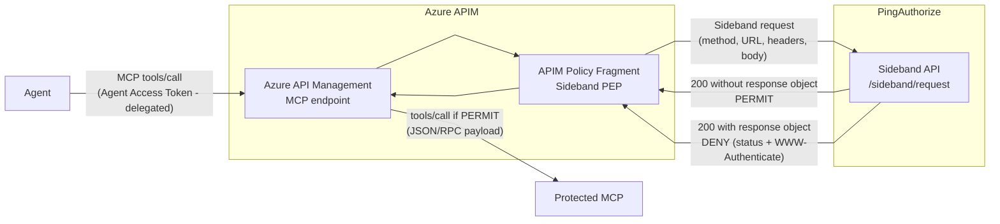

## Context

Large organizations often adopt multiple cloud platforms, modern AI services, and distributed applications, which leads to increasingly fragmented authorization. A single enterprise for example may expose MCPs through Azure, AWS, and on-premises servers.

Each platform introduces its own authorization mechanism, and over time, business rules become scattered across gateways, serverless functions, middleware, and application code. The result is duplicated policies, inconsistent decisions, difficult audits, and expensive maintenance.

PingAuthorize addresses this problem by separating **policy enforcement** from **policy decision making**. Gateways and applications remain responsible for enforcing decisions as Policy Enforcement Points (PEPs), while PingAuthorize acts as the centralized no-code Policy Decision Point (PDP).

This is the first article in a series exploring how PingAuthorize can centralize authorization decisions across different platforms and MCP environments.

I start with **Azure API Management (APIM)** protecting an MCP server, while future articles will apply the same model to other enforcement points such as AWS AgentCore Gateway.

> **Deployment note:** This series uses the PingAuthorize software, deployed in your own environment. PingAuthorize is also available as a cloud-delivered service (PingOne Authorize). The integration described here uses the **Sideband API**, a protocol shared by both products: the same policy fragment works against either deployment — only the endpoint base URL and the shared credential change.

## What Problem PingAuthorize solves: Sprawl Across Hybrid Environments

As enterprises expand across cloud providers and AI platforms, these challenges emerge.

- **Inconsistent authorization** — Business policies become embedded in platform-specific implementations. The same rule may be implemented differently across gateways, clouds, and applications, producing inconsistent decisions.
- **Policy duplication** — Authorization logic is copied into multiple enforcement points. Every policy change must then be implemented several times, increasing the risk of drift.
- **Authorization logic in code** — Without a dedicated policy engine, teams implement authorization rules directly in application code or middleware. This consumes development cycles and ties every policy change to code reviews, testing, and deployments.
- **Limited governance** — Authorization decisions are distributed across platform-specific logs, making it harder to understand why access was granted or denied and increasing the effort required for auditing and compliance.

PingAuthorize solves those challenges by centralizing **policy evaluation**: it evaluates the business policy and returns the authorization decision. This allows organizations to:

- keep business authorization rules outside applications and MCP servers
- update policies without redeploying APIs
- use contextual and attribute-based authorization
- centralize authorization decisions and audit information
- reuse the same authorization model across different platforms
- gain visibility and improve auditability by logging every authorization decision

## The solution

The first implementation in this series protects a demo Mortgage MCP Server using Azure API Management. APIM is extended via an APIM Policy Fragment that forwards the entire original MCP request to the PingAuthorize Sideband API, and then either forwards the call to the MCP server or relays the authorization denial to the caller.

The Sideband API is a reverse-proxy authorization interface: instead of sending a distilled authorization request, the enforcement point sends the original HTTP traffic — method, URL, headers, and body — to the PDP, which evaluates policy against the raw request context and returns the decision.

The following diagram depicts the components in the implementation and their interactions.



- **Agent** — invokes MCP tools through APIM using an Agent Access Token (typically obtained via Token Exchange).
- **Azure API Management** — acts as the Policy Enforcement Point. Receives the MCP request, runs the policy fragment, and either forwards the call to the backend MCP or relays the denial.
- **APIM Policy Fragment** — a reusable APIM policy artifact that preserves the original request, wraps it in a Sideband request envelope, calls the PingAuthorize Sideband API with a shared secret, and enforces the returned decision. It performs no OAuth flows of its own.
- **PingAuthorize Sideband API** — acts as the Policy Decision Point. Receives the original request, evaluates policy over the full HTTP context, and either allows the call through (no response object) or returns a complete denial response for the PEP to relay.
- **Protected MCP** — the protected MCP server (in our context a demo Mortgage MCP), receives requests only after APIM allows them through.

The important boundary is that APIM does not contain the business authorization logic. It forwards the raw request, and enforces whatever comes back.

> **Scope note:** This article focuses on the authorization integration between APIM and PingAuthorize. Token validation, token exchange, and backend MCP server security are outside the scope of this article. In a production setup, APIM would exchange the inbound token for a backend-scoped token before calling the MCP server. For simplicity, the demo MCP server is left open and no token exchanges have been configured in APIM.

## The Sideband Integration Model

A common alternative is a decision endpoint: the PEP parses the request, extracts relevant attributes into a custom payload, and asks the PDP for a decision. That works, but the mapping logic — which fields matter, how they are named and serialized — lives in the PEP and must be kept in sync with the policies.

The Sideband API removes that mapping layer. The PEP sends the original request as it arrived, and PingAuthorize evaluates policy against the full HTTP context: request method, URL, headers (including the `Authorization` bearer token and its claims), query parameters, client IP, and the request body. If a new policy needs a request field that was not previously forwarded, there is no PEP change to make — the data is already there.

The integration follows three rules:

1. **Permit** — the PDP returns HTTP 200 with no top-level `response` object. The PEP continues to the backend.
2. **Deny** — the PDP returns HTTP 200 with a top-level `response` object containing a complete response to hand back to the client: status code, reason, headers (including `WWW-Authenticate`), and body.
3. **Fail closed** — any transport failure or non-200 result is an integration error, never an access grant.

This split also has a security benefit for authentication: a denial can carry a `401` with a `WWW-Authenticate` challenge (token invalid or a step-up required) instead of a generic `403`, so the client can react to authentication and authorization failures differently.

## The APIM Policy Fragment

The integration with PingAuthorize is implemented directly as an APIM policy fragment. The fragment performs four operations:

1. Preserve the MCP request.
2. Build the Sideband request envelope.
3. Call the PingAuthorize Sideband API.
4. Enforce the returned decision.

The fragment is driven by three APIM Named Values:

| Named Value | Type | Purpose |
|---|---|---|
| `AuthorizeSidebandRequestEndpoint` | Plain | Base URL of the Sideband API **without** `/sideband/request`. Example for PingAuthorize software: `https://paz.example.com:7443`. Example for PingOne Authorize (cloud): the gateway Service URL, such as `https://http-access-api.pingone.eu/v1/environments/{environmentId}`. |
| `AuthorizeSidebandClientToken` | **Secret** | The sideband shared secret — the Sideband API shared secret configured on PingAuthorize, or the gateway credential on PingOne Authorize. |
| `AuthorizeSidebandDebug` | Plain | `false` by default. Set to `true` temporarily to return a redacted Sideband request and the complete authorization response to the API client for diagnostics. |

### 1. Preserve the MCP Request

The Sideband API requires the original body as a string, so the fragment reads it before anything else and preserves it for later forwarding:

```xml
<set-variable
    name="authorizeOriginalRequestBody"
    value="@(context.Request.Body == null
        ? string.Empty
        : context.Request.Body.As&lt;string&gt;(preserveContent: true))" />
```

### 2. Build the Sideband Request Envelope

The envelope mirrors the original request. APIM rebuilds the full request URL (scheme, host, optional port, path, query string), and collects the headers as an array of single-entry objects — the shape the Sideband API expects. The `Authorization` header carries the agent's bearer token unchanged, which is what lets PingAuthorize validate and inspect the caller's token.

```xml
<set-variable name="authorizeSidebandRequestBody" value="@{
    var originalUrl = context.Request.OriginalUrl;
    var scheme = originalUrl.Scheme.ToLowerInvariant();
    var includePort = (scheme == &quot;http&quot; &amp;&amp; originalUrl.Port != 80) ||
                      (scheme == &quot;https&quot; &amp;&amp; originalUrl.Port != 443);
    var requestUrl = originalUrl.Scheme + &quot;://&quot; +
                     originalUrl.Host +
                     (includePort ? &quot;:&quot; + originalUrl.Port.ToString() : string.Empty) +
                     originalUrl.Path +
                     originalUrl.QueryString;

    var sidebandHeaders = new JArray();
    sidebandHeaders.Add(new JObject(new JProperty(&quot;Accept&quot;, &quot;application/json&quot;)));
    sidebandHeaders.Add(new JObject(new JProperty(&quot;Content-Type&quot;, &quot;application/json&quot;)));
    sidebandHeaders.Add(new JObject(new JProperty(&quot;Host&quot;,
        originalUrl.Host +
        (includePort ? &quot;:&quot; + originalUrl.Port.ToString() : string.Empty))));
    sidebandHeaders.Add(new JObject(new JProperty(&quot;Authorization&quot;,
        context.Request.Headers.GetValueOrDefault(&quot;Authorization&quot;, string.Empty))));

    var serializedBody =
        (string)context.Variables[&quot;authorizeOriginalRequestBody&quot;];

    if (!string.IsNullOrEmpty(serializedBody))
    {
        try
        {
            serializedBody = JToken.Parse(serializedBody)
                .ToString(Newtonsoft.Json.Formatting.None);
        }
        catch
        {
            // Preserve a non-JSON body exactly as received.
        }
    }

    var payload = new JObject(
        new JProperty(&quot;source_ip&quot;, context.Request.IpAddress ?? string.Empty),
        new JProperty(&quot;source_port&quot;, 5034),
        new JProperty(&quot;method&quot;, context.Request.Method),
        new JProperty(&quot;url&quot;, requestUrl),
        new JProperty(&quot;http_version&quot;, &quot;1.1&quot;),
        new JProperty(&quot;headers&quot;, sidebandHeaders),
        new JProperty(&quot;body&quot;, serializedBody)
    );

    return payload.ToString(Newtonsoft.Json.Formatting.None);
}" />
```

One field deserves an explanation. APIM policy expressions cannot access the originating TCP source port, but the Sideband API requires a `source_port` value between 1 and 65535. The fragment therefore uses a fixed synthetic value (`5034`), matching the reference implementation the fragment was modeled on. If your policies need the real client port, this is a known limitation to plan around.

### 3. Call the Sideband API

The fragment posts the envelope to `{endpoint}/sideband/request`, authenticating with the shared secret in the `PDG-TOKEN` header:

```xml
<send-request
    mode="new"
    response-variable-name="authorizeSidebandResponse"
    timeout="20"
    ignore-error="true">

    <set-url>@(&quot;{{AuthorizeSidebandRequestEndpoint}}&quot;.TrimEnd('/') + &quot;/sideband/request&quot;)</set-url>
    <set-method>POST</set-method>

    <set-header name="PDG-TOKEN" exists-action="override">
        <value>{{AuthorizeSidebandClientToken}}</value>
    </set-header>

    <set-header name="Content-Type" exists-action="override">
        <value>application/json</value>
    </set-header>

    <set-header name="Accept" exists-action="override">
        <value>application/json</value>
    </set-header>

    <set-body>@((string)context.Variables["authorizeSidebandRequestBody"])</set-body>
</send-request>
```

The credential header name is part of the Sideband API configuration, so it must match what your PingAuthorize Sideband API endpoint expects — `PDG-TOKEN` here, `CLIENT-TOKEN` in some other integrations.

Note that unlike a decision-endpoint integration, the fragment does **not** fetch an OAuth token. The shared secret authenticates the PEP to the PDP directly, which removes an entire token-acquisition round trip (and the token-caching policies that production would otherwise require).

### 4. Enforce the Decision

First, fail closed on transport problems. A failed call leaves the response variable empty:

```xml
<choose>
    <when condition="@(!context.Variables.ContainsKey(&quot;authorizeSidebandResponse&quot;)
        || context.Variables[&quot;authorizeSidebandResponse&quot;] == null)">
        <return-response>
            <set-status code="502" reason="Bad Gateway" />
            <set-header name="Content-Type" exists-action="override">
                <value>application/json</value>
            </set-header>
            <set-body>@{
                return new JObject(
                    new JProperty("error",
                        new JObject(
                            new JProperty("code", "sideband-unavailable"),
                            new JProperty("message",
                                "Authorization Sideband service is unavailable")
                        )
                    )
                ).ToString();
            }</set-body>
        </return-response>
    </when>
</choose>
```

A non-200 status is also an integration error — not an authorization denial — and returns `502` with a `sideband-error` code.

With HTTP 200 in hand, the semantics are simple: a top-level `response` object means DENY; its absence means PERMIT.

```xml
<set-variable
    name="authorizeSidebandBody"
    value="@(((IResponse)context.Variables[&quot;authorizeSidebandResponse&quot;])
        .Body.As&lt;JObject&gt;(preserveContent: true))" />

<choose>
    <when condition="@(((JObject)context.Variables[&quot;authorizeSidebandBody&quot;])[&quot;response&quot;] is JObject)">
        <!-- DENY: extract the relay fields from the response object -->
    </when>
</choose>

<!-- No response object means PERMIT; continue to the backend unchanged. -->
```

On denial, the fragment extracts `response_code`, `response_status`, the response headers (looking for `content-type` and `www-authenticate`), and the body, then relays them to the caller. The status is the authorization service's own decision — `401` for authentication failures or step-up, `403` for authorization failures — not a status APIM invented:

```xml
<set-variable name="authorizeDenyStatus" value="@{
    var denial = ((JObject)context.Variables[&quot;authorizeSidebandBody&quot;])[&quot;response&quot;];
    int status;

    return Int32.TryParse((string)denial[&quot;response_code&quot;], out status)
        &amp;&amp; status &gt;= 100 &amp;&amp; status &lt;= 599
            ? status
            : 403;
}" />

<set-variable name="authorizeDenyReason" value="@{
    var denial = ((JObject)context.Variables[&quot;authorizeSidebandBody&quot;])[&quot;response&quot;];
    return (string)denial[&quot;response_status&quot;] ?? &quot;Forbidden&quot;;
}" />
```

The relayed body preserves the JSON-RPC envelope: the fragment reads the `id` from the original MCP request so the error correlates with the call, passes through the PDP's denial body when present, and otherwise synthesizes a JSON-RPC error (`-32001` for 401, `-32003` otherwise):

```json
{
  "jsonrpc": "2.0",
  "id": 2,
  "error": {
    "code": -32003,
    "message": "Forbidden"
  }
}
```

Finally, the denial is returned with the authorization service's status, reason, and `WWW-Authenticate` header when one was supplied.

The fragment also supports a temporary diagnostics mode: when `{{AuthorizeSidebandDebug}}` is `true`, denials and integration errors return the redacted Sideband request (with `Authorization`, `Cookie`, and `Proxy-Authorization` headers masked) and the complete authorization response to the API client, which makes endpoint and payload mistakes obvious during setup. Remove it before production.

## The Sideband Request

For an MCP call such as:

```json
{
    "jsonrpc": "2.0",
    "id": 2,
    "method": "tools/call",
    "params": {
        "name": "get_mortgage_summary",
        "arguments": {
            "customerId": "CUST-10001"
        }
    }
}
```

the Sideband request the fragment sends looks like:

```json
{
  "source_ip": "203.0.113.10",
  "source_port": 5034,
  "method": "POST",
  "url": "https://apimid4ai.azure-api.net/mortgage-mcp/mcp/mortgage",
  "http_version": "1.1",
  "headers": [
    { "Accept": "application/json" },
    { "Content-Type": "application/json" },
    { "Host": "apimid4ai.azure-api.net" },
    { "Authorization": "Bearer <agent-access-token>" }
  ],
  "body": "{\"jsonrpc\":\"2.0\",\"id\":2,\"method\":\"tools/call\",\"params\":{\"name\":\"get_mortgage_summary\",\"arguments\":{\"customerId\":\"CUST-10001\"}}}"
}
```

The same call can be reproduced with `curl`, which is exactly how the reference test client exercises the endpoint:

```bash
curl -s "https://paz.example.com:7443/sideband/request" \
  -H "PDG-TOKEN: $SIDEBAND_CREDENTIAL" \
  -H "Content-Type: application/json" \
  -H "Accept: application/json" \
  -d '{
    "source_ip": "203.0.113.10",
    "source_port": 5034,
    "method": "POST",
    "url": "https://apimid4ai.azure-api.net/mortgage-mcp/mcp/mortgage",
    "http_version": "1.1",
    "headers": [
      { "Accept": "application/json" },
      { "Content-Type": "application/json" },
      { "Host": "apimid4ai.azure-api.net" },
      { "Authorization": "Bearer <agent-access-token>" }
    ],
    "body": "{\"jsonrpc\":\"2.0\",\"id\":2,\"method\":\"tools/call\",\"params\":{\"name\":\"get_mortgage_summary\",\"arguments\":{\"customerId\":\"CUST-10001\"}}}"
  }'
```

A PERMIT returns HTTP 200 with no `response` object; a DENY returns HTTP 200 with one:

```json
{
  "response": {
    "response_code": 403,
    "response_status": "Forbidden",
    "headers": [
      { "Content-Type": "application/json" }
    ],
    "body": "{\"jsonrpc\":\"2.0\",\"id\":2,\"error\":{\"code\":-32003,\"message\":\"Forbidden\"}}"
  }
}
```

## Policies

The demo authorizes a mortgage MCP server. The inbound token carries the scopes the caller holds, plus — when the call is delegated — the human principal and the agent acting on their behalf:

```json
{
  "sub": "vip_user",
  "sub_type": "vip_user",
  "aud": "https://apimid4ai.azure-api.net",
  "scope": "mortgage:read mortgage:write",
  "act": {
    "sub": "customer_support_agent"
  },
  "approved_for": "submit_mortgage_change_request"
}
```

In sideband mode, PingAuthorize receives the original request and exposes its HTTP context to policies: request method, URI, headers, query parameters, client IP, the request body, and the claims of the bearer token in the `Authorization` header. Policies read the MCP context from the JSON-RPC body through JSONPath attributes — the method, the tool name, and risk-relevant arguments such as `changeType` — and the token claims from the bearer token. For example, `$.params.name` exposes the tool being invoked and `$.params.arguments.changeType` exposes the requested change, so rules can key on both.

The demo policies for the mortgage service, in evaluation order (first applicable wins):

| # | Policy | Fires when | Decision |
|---|---|---|---|
| 1 | Session Methods | method is `initialize`, `tools/list`, or `ping` | PERMIT |
| 2 | VIP Delegation Gate | call is delegated (`act.sub` present) and the subject is not a VIP user | DENY — `delegation_not_permitted` |
| 3 | Mortgage Reads | a read tool and scope `mortgage:read` | PERMIT |
| 4 | Benign Changes | `changeType = PAYMENT_DATE` and scope `mortgage:write` | PERMIT |
| 5 | Risky Changes – Approval Required | risky `changeType` (RATE_SWITCH, TERM_CHANGE, OVERPAYMENT) and no approval binding | DENY — `approval_required` |
| 6 | Risky Changes – Approved | risky `changeType` and `approved_for = submit_mortgage_change_request` | PERMIT |
| 7 | Default Deny | anything else | DENY |

Expired or invalid tokens are rejected earlier by token validation, so the matrix above only sees well-formed tokens. Three design ideas are worth calling out:

- **Scopes are capability classes, policies map tools to classes.** Tokens carry coarse scopes (`mortgage:read`, `mortgage:write`); the policy decides which tools they cover. Adding a tool never requires re-issuing tokens.
- **Risk lives in the payload, not the tool.** The same `submit_mortgage_change_request` call flips between permit and approval-required based on the `changeType` argument — the sideband model makes the full payload available to policy without any gateway-side mapping.
- **Human-in-the-loop is deny-with-challenge.** The PDP cannot pause a decision. Risky changes are denied with an `approval_required` challenge; once a human approves out-of-band, the approval is minted into a short-lived, purpose-bound token claim (`approved_for`), and the same call retried flows through the approval rule. Delegation is gated the same way: only VIP subjects may be operated through the delegated agent.

The e2e test suite in the reference project runs the full matrix through the live chain — 14 assertions covering the session methods, reads, benign and risky changes, approval retry, unknown tools, expired tokens, and the delegation gate — asserting 200 permit, 403 policy deny, or 401 invalid token on each.

The following picture shows what such a policy looks like in the policy designer (shown here in PingOne Authorize, the cloud counterpart of PingAuthorize).


The following two pictures show how the Decision Visualizer depicts its decisioning process. The first shows a PERMIT evaluation; the second shows a DENY due to an invalid actor subject.


> Note: the screenshots above are from the earlier customer-MCP demo; the current mortgage demo uses the same designer and visualizer, so the screens differ only in attribute and rule names.

## Key Takeaways

This article explained how PingAuthorize provides centralized dynamic authorization for Azure API Management. APIM acts as a Policy Enforcement Point for MCP servers without embedding business authorization rules in the gateway or in the protected MCP servers themselves. The policy fragment is the only integration artifact needed, and because it speaks the Sideband API — shared between PingAuthorize software and PingOne Authorize in the cloud — the same artifact enforces the same policies against either deployment.

Compared with a decision-endpoint integration, the sideband model keeps the PEP thin:

- the PEP forwards the original request instead of mapping it into a custom payload, so no context-extraction logic lives in the gateway
- the PEP authenticates with a shared secret instead of maintaining its own OAuth client and token cache
- denials relay the PDP's status, challenge, and body verbatim, so authentication failures (`401` + `WWW-Authenticate`) stay distinguishable from authorization failures (`403`)
- missing or unreachable PDP results in a fail-closed `502`, never silent access

This pattern is most useful when:

- Multiple teams or platforms maintain separate authorization policies that express the same business rules, making drift and inconsistency inevitable.
- Policy changes require coordinated redeployments across gateways, functions, or application code.
- Compliance or audit requirements need a centralized, queryable record of every authorization decision regardless of where it was enforced.
- Authorization rules depend on contextual or dynamic attributes — user roles, risk scores, time constraints — that must evolve independently of the applications that enforce them.

The next articles will apply the same pattern to additional enforcement surfaces such as AWS AgentCore Gateway, further showing how authorization decisions can be centralized and standardized across platforms.

---

**Resources**

- [PingAuthorize Sideband API](https://docs.pingidentity.com/pingauthorize/11.1/pingauthorize_server_administration_guide/paz_about_sideband_api.html){:target="_blank"} — how the Sideband API proxies authorization decisions.
- [Sideband API configuration](https://docs.pingidentity.com/pingauthorize/11.1/pingauthorize_server_administration_guide/paz_sideband_api_config.html){:target="_blank"} — configuring Sideband API endpoints and services on PingAuthorize.
- [Azure API Management policies](https://learn.microsoft.com/en-us/azure/api-management/api-management-policies){:target="_blank"} — reference for APIM inbound policy expressions and `send-request`.
- [Source code](https://github.com/carbonefederico/ai-mcp-gateways-paz-integrations) — APIM policy fragment and configuration guidelines, including the mortgage policy set and its end-to-end test suite (`azure-apim/test/policy-e2e-tests.sh`).
