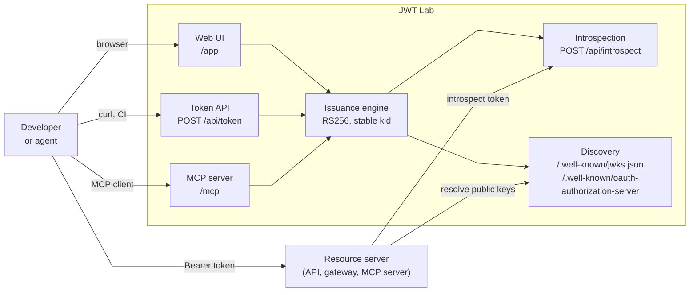

## Context

When I build or test something that consumes tokens (an API, a gateway, an MCP server, a policy enforcement point, etc.), I need valid tokens. Real RS256 JWTs with the right `aud`, `scope`, and `act` claims, signed by an issuer the resource server can verify against a JWKS.

Real identity providers can do this, but they are heavy when the IdP is only a dependency. Issuing a token with the claims I want usually means registering clients, configuring signing keys and mappings, and having the environment reachable. That is worth it when I am testing the IdP itself. It is slow when what I actually want to test is the resource server, the gateway policy, or how an agent handles an actor chain.

## What JWT Lab Is

JWT Lab is a minimal token issuer that plays the role an identity provider plays in token-based testing. You supply the claims you need — subject, audience, scopes, delegation — and it signs them into a real RS256 JWT with a stable key and `kid`, publishing the matching JWKS so a resource server can validate the token exactly the way it would validate an IdP-issued one. Everything else an IdP does is intentionally absent: no grant flows, no sign-in, no consent, no client registration. Tokens are stateless, and the issuer never sees who requested them.

The same issuance engine is exposed through three surfaces:



- Web UI: pick a preset scenario, edit the claims JSON, mint a token, copy it.
- Token API: `POST /api/token` for scripted and CI-driven tests.
- Introspection: `POST /api/introspect` answers RFC 7662 validation questions — signature and expiry checked server-side.
- Discovery: the JWKS at `/.well-known/jwks.json` and the OAuth server metadata at `/.well-known/oauth-authorization-server`.
- MCP server: five tools so an agent can issue and introspect tokens itself.

All three issuance surfaces produce tokens signed with the same stable key and `kid`, so a token issued from any surface validates against the same JWKS.

A token exchange is only half the story: what the token is for is testing the thing that receives it. The diagram shows the second half. The resource server under test accepts the minted token as a Bearer credential and then validates it through one of the two validation modes — locally, by resolving the published JWKS and checking signature, issuer, audience, and expiry itself, or remotely, by calling the introspection endpoint and letting JWT Lab answer `active: true` or `active: false`. Both modes are the ones real resource servers use, which is what makes the tokens drop-in replacements for IdP-issued ones.

## The Web UI

The UI is at `/app`. Presets cover the token shapes I use most often, grouped by category:

- Core: a basic user token, a machine or workload token
- MCP: a user access token for an MCP server, an agent identity token
- Delegation: a user-to-agent token with an RFC 8693 `act` claim, and a nested `act` chain for user to orchestrator to specialist agent
- Negative tests: insufficient scope, wrong audience, expired token
- Edge cases: multi-audience arrays

A token for a delegated agent flow is one click on `Delegated user → agent`, a small edit to the claims, and `Issue token`:

```json
{
  "sub": "alice",
  "aud": "https://bank.example/mcp",
  "scope": "portfolio.read",
  "act": {
    "sub": "investment-advisor-agent"
  }
}
```

The result panel shows the full JWT with its decoded header and payload, ready to copy into whatever I am testing. An advanced toggle unlocks the reserved claims, so I can override `iss`, `iat`, `exp`, `nbf`, and `jti` when I need to forge specific conditions, such as a token that is not yet valid.

## The REST API

The API exists for tests that need to mint tokens programmatically: a CI job preparing an integration test, or a local script that issues a token and injects it into a request before calling the resource server.

Issuing a token starting from a preset and overriding individual claims:

```bash
curl https://jwt-lab-beta.vercel.app/api/token \
  -H 'content-type: application/json' \
  -d '{
    "preset": "delegated-agent",
    "claims": {
      "sub": "alice",
      "aud": "https://bank.example/mcp",
      "scope": "portfolio.read"
    },
    "expiresIn": 3600
  }'
```

Preset claims are applied first, and explicit claims override them. The response carries the signed token plus the decoded header and payload, so the test can inspect what it just minted:

```json
{
  "access_token": "eyJhbGciOiJSUzI1NiIs...",
  "token_type": "Bearer",
  "expires_in": 3600,
  "jwks_uri": "https://jwt-lab-beta.vercel.app/.well-known/jwks.json",
  "decoded": {
    "header": { "alg": "RS256", "kid": "jwt-lab-rs256-1" },
    "payload": { "sub": "alice", "act": { "sub": "investment-advisor-agent" } }
  }
}
```

Introspection follows RFC 7662 and is form-encoded. The endpoint verifies the signature against its own keys and checks expiry itself:

```bash
curl -X POST https://jwt-lab-beta.vercel.app/api/introspect \
  -d 'token=eyJhbGciOiJSUzI1NiIs...'
```

A valid token returns `active: true` with its claims. Expired, tampered, or malformed tokens return `{"active": false}`. This is useful for testing introspection-mode resource servers, including their negative paths.

The discovery endpoints round out the picture. A resource server or MCP authorization flow can resolve the JWKS from `/.well-known/jwks.json`, and `/.well-known/oauth-authorization-server` exposes issuer metadata including the introspection endpoint. `GET /api/presets` lists every preset and its default claims, so a script can discover scenarios instead of hard-coding them.

## The MCP Interface

The MCP endpoint is at `/mcp` over Streamable HTTP. Point any MCP client at it:

```text
https://jwt-lab-beta.vercel.app/mcp
```

It exposes five tools:

- `issue_token`: mint a JWT, optionally from a preset with claim overrides
- `introspect_token`: verify a token and return its active status and claims
- `list_presets`: list the built-in testing scenarios
- `get_jwks`: return the public key set
- `get_oauth_metadata`: return the OAuth server metadata

The interesting part is what this enables. When I use an agent to wire up or test an integration, the agent can call `issue_token` itself, take the `access_token` from the result, and immediately inject it into whatever it is testing, with no copy-paste step in between. The MCP interface uses the same issuance engine as the UI and the API, so the token an agent mints behaves exactly like one issued from the UI.

## Testing the Negative Paths

Most resource-server bugs live in the failure paths, not the happy path. JWT Lab has presets for the conditions a resource server should reject:

- a valid token that intentionally lacks the privileged scope
- a valid signed token with the wrong audience
- a token whose `exp` is already in the past

Each one is a validly signed JWT, which is the point: they fail for the reason the test intends, not because the signature is broken. Issued with negative `expiresIn` or overridden `exp` claims, expired tokens also come back as `{"active": false}` from introspection.

## Security Note

JWT Lab is intentionally unsafe as an identity system. Anyone who can reach the deployment can mint tokens, and the introspection endpoint is unauthenticated. That is fine because the tokens are only trusted by things I am testing.

Never configure a production resource server to trust the JWT Lab issuer. It is a development tool, not an IdP.

## Key Takeaways

JWT Lab removes the IdP setup tax from token-based testing. By the end of a session with it you have:

- minted RS256 tokens with exact `aud`, `scope`, and `act` claims through a UI, a REST API, or an MCP tool
- validated them against a stable published JWKS
- tested expired, wrong-audience, and insufficient-scope paths with dedicated presets

The three surfaces share one issuance engine, so the same scenario works interactively, in CI, and from an agent.

## Links

- Source code: [carbonefederico/jwt-lab](https://github.com/carbonefederico/jwt-lab)
- Live deployment: [https://jwt-lab-beta.vercel.app](https://jwt-lab-beta.vercel.app)
- Token introspection: [RFC 7662](https://datatracker.ietf.org/doc/html/rfc7662)
- Token exchange `act` claim: [RFC 8693](https://datatracker.ietf.org/doc/html/rfc8693)
