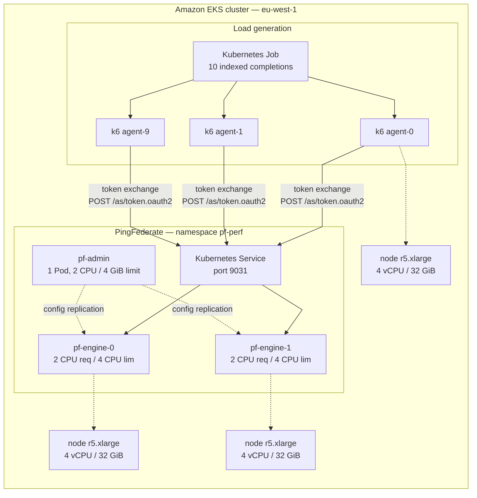

## Context

Token exchange has become the de-facto standard way to cross a trust boundary in agentic architectures. The agent receives a user-scoped token, proves its own identity, and exchanges both for a new token targeted at the next service. I have described the pattern in earlier posts on [SPIFFE workload identity](/posts/spiffe-token-exchange-for-agent-workloads/) and on [protecting MCP servers](/posts/protecting-mcp-servers-with-agentcore-gateway-and-pingone-authorize/).

Whenever I propose it, the same performance concern comes up: every extra exchange adds a hop to the authorization server, and a chatty agent could multiply that hop many times. The concern is reasonable, but it is usually stated without data. So I measured it. The short version: at 500 exchanges per second the p95 latency was 23 milliseconds and both engines together used fewer than three cores, with zero failures across the whole campaign. One exchange costs about six milliseconds of a single core.

The campaign tops out at 500 exchanges per second by choice. For small and medium environments that is a sensible baseline — several times what a mid-size agent platform generates — and driving past it on shared test hardware would measure the neighbors' load as much as PingFederate.

## The scenario

The deployment is the standard Ping Identity Kubernetes topology: one administration Pod and two PingFederate engine Pods behind a single Kubernetes Service. Load is generated by ten k6 agent Pods inside the same cluster, so the measured network path is the one production clients would experience — no laptop-to-cluster transit, no ingress.

- k6 agent Pods: every iteration signs a brand-new RS256 subject token and exchanges it exactly once — no token is reused, no two requests carry the same token. The 10 Pods simulate 10 concurrent agent instances acting on behalf of one pool of 100 synthetic user identities, rotating round-robin. In PingFederate there is exactly one OAuth client (`perf-test-client`); all ten Pods authenticate as it.
- Kubernetes Service: load-balances across both engine Pods on port 9031; admin traffic is not part of the test.
- PingFederate engines: run the measured path — JWT validation, token-exchange policy, output-token signing.
- PingFederate admin: configures the engines through cluster replication and stays idle.

Each exchange is a production-shaped RFC 8693 request: `client_secret_basic` authentication, a self-contained JWT subject token validated against a JWKS (issuer, audience, expiry all checked from the token itself), the token-exchange policy, and an RS256-signed output token. Deliberately excluded: user authentication (subject tokens are self-signed by the generator — no IdP round-trip), persistent-grant storage (the client is grant-only `TOKEN_EXCHANGE`, so the store is never touched), and external policy calls. The results are a floor for real deployments; those add storage-backed steps on top.

The PingFederate side is fully declarative: a server profile carries all required objects as bulk-config JSON that the image imports at startup, and both engines are guaranteed identical configuration through cluster replication.

## Test stages and environment

The campaign ran four stages, each five minutes at a constant arrival rate with a 30-second warmup excluded from the measured series: 100 exchanges per second (first with 2 agents, then the full 10), then 250 and 500. Each agent Pod drives total-rate/10 arrivals per second — at the 500 stage, 10 Pods × 50 = 500. The constant-arrival-rate executor opens each request on schedule regardless of response time, so it measures latency under controlled arrival, not throughput at saturation. The measured window delivered exactly what was configured: 500.05 exchanges per second.

The environment, in full:

**Cluster.** Amazon EKS, region eu-west-1, Kubernetes 1.35 (EKS build), six worker nodes, Amazon Linux 2023.

**Nodes.** All r5.xlarge: 4 vCPU and 32 GiB each — roughly 24 vCPU of total capacity. The cluster is shared development infrastructure hosting the other demo workloads I use for articles at all times, and the k6 Pods were scheduled with no pinning. The test never came close to using that capacity, and did not need to: the measured workload — two engines, the admin, and ten generators — asks for roughly 5 to 6 cores of the 24. The numbers below describe what PingFederate does at 500 exchanges per second, not what the cluster can do.

**PingFederate sizing.** Deliberately modest, close to a small production starter:

| Pod | CPU request | CPU limit | Memory request | Memory limit |
|---|---:|---:|---:|---:|
| pf-admin (1) | 1 | 2 | 2 Gi | 4 Gi |
| pf-engine (2) | 2 | 4 | 3 Gi | 6 Gi |

Engines carry a preferred anti-affinity rule for different nodes and a PodDisruptionBudget of `minAvailable: 1`. Load generation: 10 k6 Pods, each requesting 1 CPU.

**How the data is captured.** Three independent sources, so no number rests on a single pipe. First, per-request latency streams: every k6 Pod writes its metrics as streaming NDJSON to a file, and the test script snapshots each stream every three seconds while the Pods run — the only way to get per-request detail out, since k6's stream is write-only from the outside and Kubernetes TTL-deletes the Pods an hour after the run. Warmup points carry a `phase` tag and are excluded from every reported number. Second, the k6 end-of-run summaries, captured from the Pod logs before deletion — the authoritative totals the snapshots are checked against. Third, a monitor loop samples `kubectl top pods` and `kubectl top node` every five seconds into a CSV, tying latency to resource consumption. The report generator reads all three and renders a self-contained HTML dashboard per run on one shared time axis.

## The results

Across the four stages: 285,030 token exchanges, 100% success, all thresholds passed. Not one failed or malformed OAuth response in the entire campaign.

### Latency by stage

Measured phase only, warmup excluded:

| Stage | Delivered rate | Requests | avg | median | p90 | p95 | p99 |
|---|---:|---:|---:|---:|---:|---:|---:|
| 100/s (2 agents) | 100.0/s | 30,002 | 4.6 ms | 4.3 ms | 5.7 ms | 6.6 ms | — |
| 100/s (10 agents) | 100.0/s | 30,005 | 5.2 ms | 4.7 ms | 6.4 ms | 8.1 ms | — |
| 250/s | 250.0/s | 75,008 | 6.7 ms | 5.5 ms | 10.2 ms | 13.4 ms | 26.4 ms |
| 500/s | 500.0/s | 150,015 | 9.4 ms | 6.9 ms | 17.6 ms | 22.6 ms | 36.0 ms |

Latency scales gently and almost linearly through the tested range. Going from 100 to 250 exchanges per second costs one and a half milliseconds of average latency; doubling to 500 roughly doubles the p95 and still leaves it under 23 milliseconds.

### Latency and CPU over time at 500 exchanges per second

The two charts below are the report generator's time-series output for the 500 stage. Both are snapshots in time: the axis labels are baked in at publication, and the axis units are raw report values (milliseconds for response time, milli-cores for CPU).

{: .img-fluid }

After the run settles, the p90 flatlines around 19 milliseconds for the rest of the five minutes. No drift, no creep, no gradual degradation.

{: .img-fluid }

Combined engine CPU holds steady at about 2.9 cores — the chart's 2,900 milli-cores — with each Pod under 1.8 of its four-core limit. At this load PingFederate is running well inside its comfort zone, at a stable price.

### Resource consumption

Steady-state combined engine CPU and the CPU cost per exchange:

| Delivered rate | Engine CPU avg | Engine CPU peak | CPU per exchange |
|---:|---:|---:|---:|
| 250/s | 1.48 cores | 2.13 cores | 5.9 CPU-ms |
| 500/s | 2.91 cores | 3.01 cores | 5.8 CPU-ms |

The last column is engine CPU divided by exchange rate — how much of one core's time one exchange consumes. It sits at close to six CPU-milliseconds at every stage, which makes capacity arithmetic trivial: multiply your target exchange rate by six milliseconds. Memory is a non-story: engine Pods sat at about 0.7 GiB per Pod at 250 exchanges per second and about 1.1 GiB at 500, well under the 3 GiB request — there is no per-session state to grow.

### What an agent platform actually needs

Compare the tested range against a realistic deployment. A medium-sized organization: 1,000 employees, ~10% concurrently active in the agent at peak, so ~100 users. Each action fans out to four or five MCP servers in different trust domains; every trust boundary costs one exchange — call it six per action. At 10 actions per minute per active user: 100 × 10 × 6 / 60 = 100 exchanges per second. That is a fifth of what this starter sizing absorbed at a 23 ms p95 — and the cost is per action, not per LLM call inside the reasoning loop.

## When the concern is valid

What this test does not prove:

- **No persistent storage on the path.** Opaque tokens validated by grant lookup, or refresh-token flows, would add a datastore round-trip per request — meaningful with an external shared datastore. Plan capacity for it.
- **No IdP round-trip.** Real user authentication happens once, outside the exchange path. If your design re-authenticates inside hot loops, these numbers are not yours.
- **Capped at 500 exchanges per second.** The campaign stops there by design: driving past it on shared test hardware would measure neighboring-tenant contention as much as PingFederate capacity. On dedicated hardware the curve would extend further; where exactly it lands is an exercise for hardware the cluster does not have.

## Key takeaways

The headline is simple: token exchange adds almost nothing to what the user experiences. An LLM reasoning step takes seconds; an agent loop takes tens of seconds; the token-exchange hop is milliseconds. The identity hop is effectively invisible next to the intelligence hop.

That is the point to carry into architecture discussions. Exchange once per trust boundary, keep subject tokens self-contained JWTs so validation needs no store lookup, size engines at roughly one core per 170 sustained exchanges per second — and then stop worrying about the token-exchange hop. The thing to optimize in an agentic platform is the reasoning loop; the identity layer is not where the time goes.

---

**Resources**

- [pingfederate-token-exchange-perf](https://github.com/carbonefederico/pingfederate-token-exchange-perf){:target="_blank"} — the full project: Helm charts, k6 script, monitor and report tooling, and the raw results for every run in this article.
- [OAuth 2.0 Token Exchange](https://datatracker.ietf.org/doc/html/rfc8693){:target="_blank"} — RFC 8693.
- [PingFederate OAuth configuration](https://docs.pingidentity.com/pingfederate/latest/administrators_reference_guide/pf_oauth_config.html){:target="_blank"} — token-exchange processor policies and access token managers.
- [k6 documentation](https://grafana.com/docs/k6/latest/){:target="_blank"} — constant-arrival-rate executor and thresholds.
- [Securing agentic workflows with token exchange and workload identity](/posts/spiffe-token-exchange-for-agent-workloads/){:target="_blank"} — the identity pattern this test measures the cost of.
